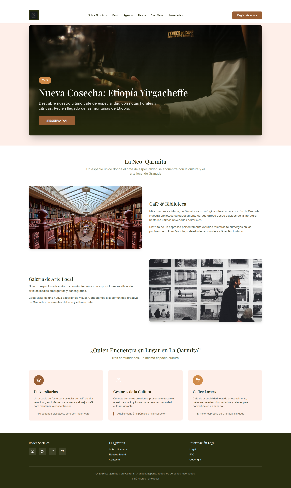
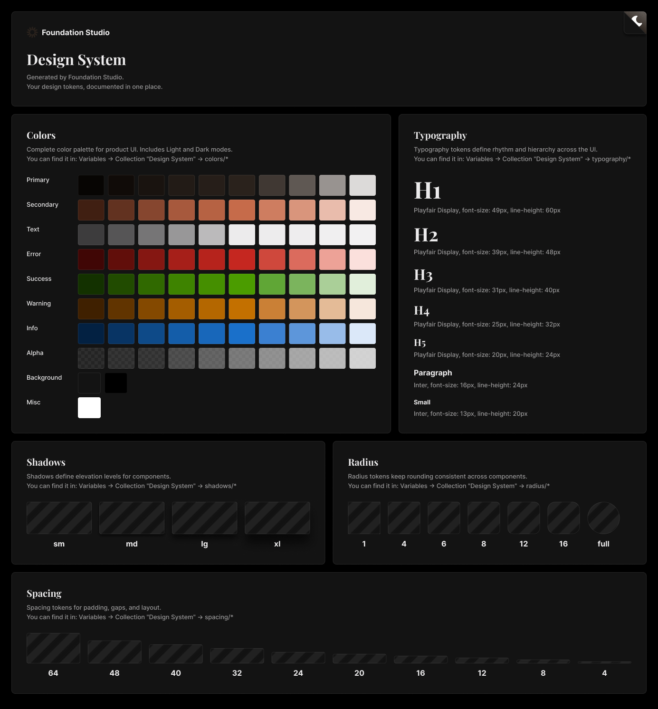
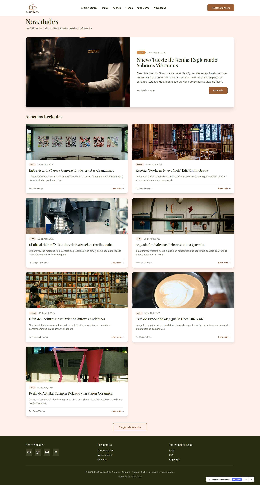
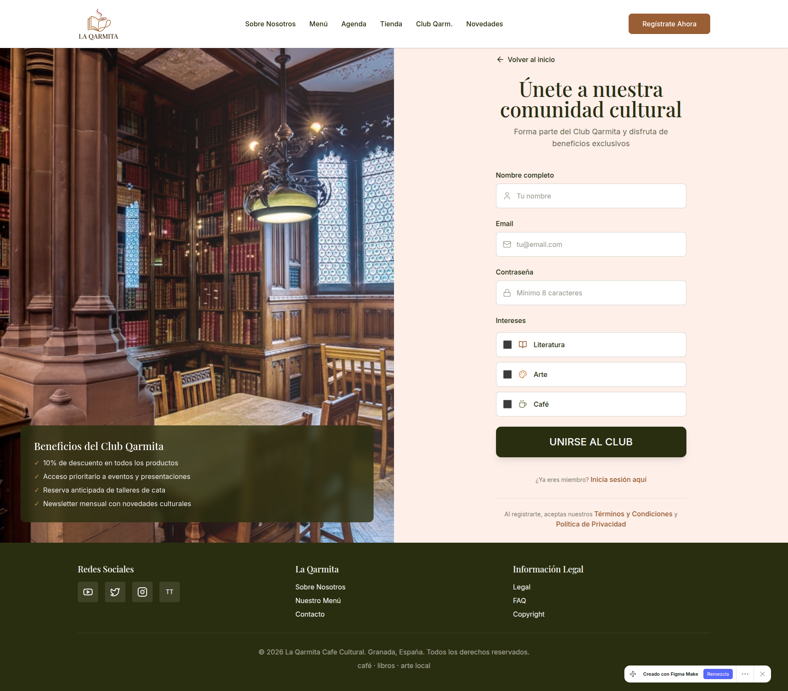
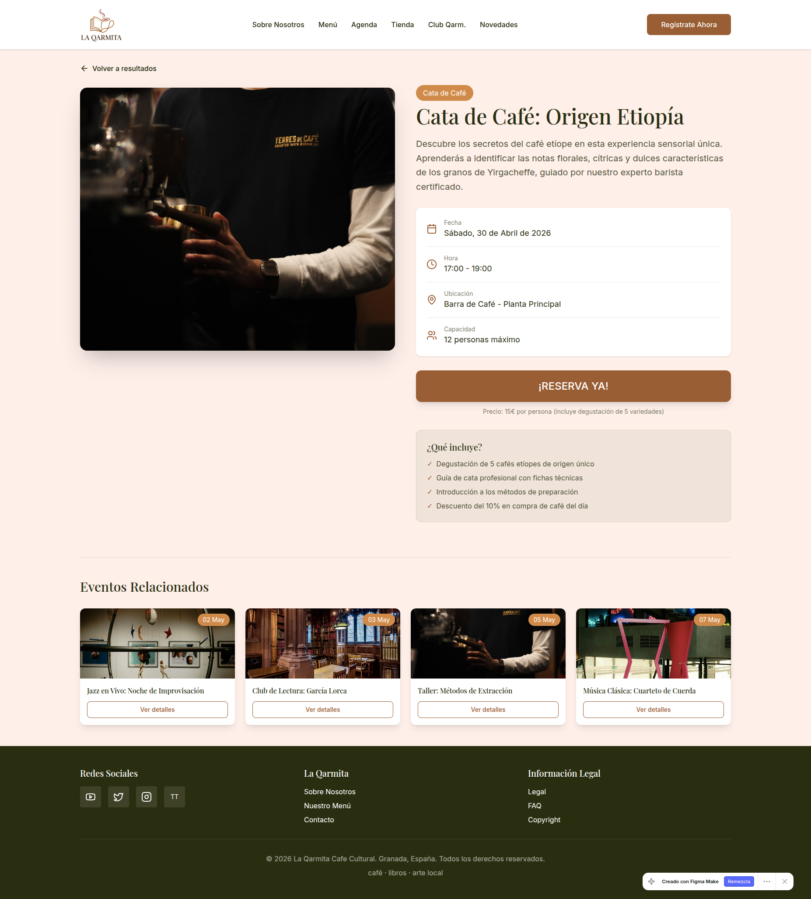
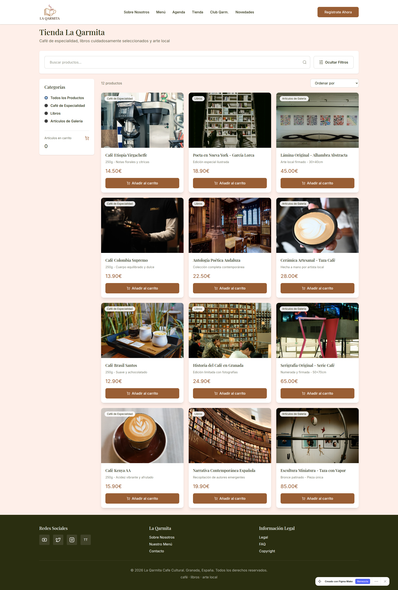
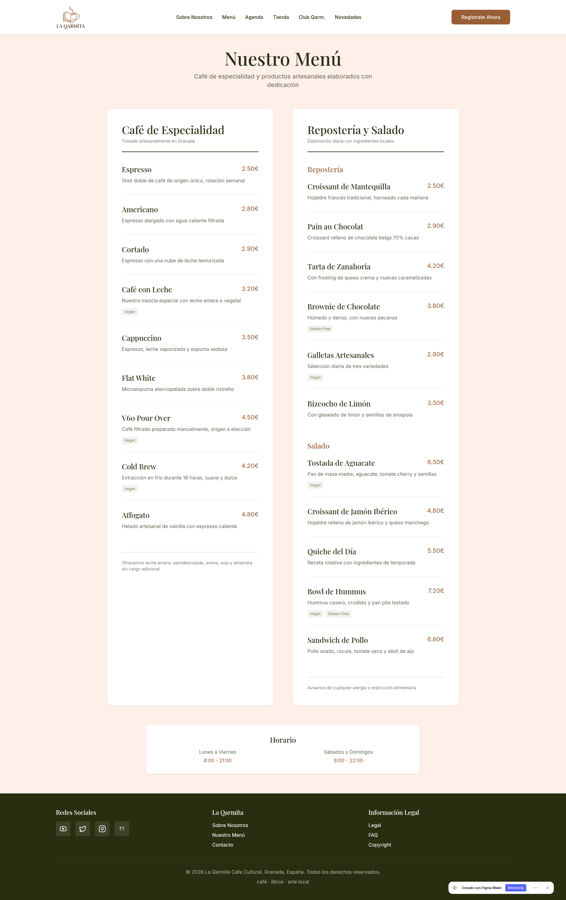
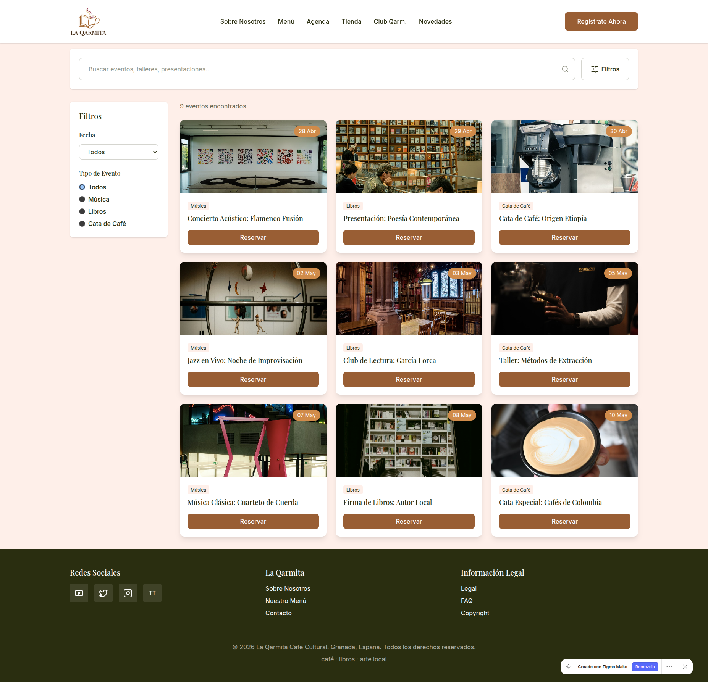

# Práctica 3: Prototipado / Mockup
## Equipo: Errores404 (DIU2)

Este documento detalla el proceso de diseño de alta fidelidad (Hi-Fi) realizado para el proyecto **La Qarmita - Cultura y Café**. Se ha seguido una metodología de **Atomic Design** y se han utilizado herramientas de Inteligencia Artificial para agilizar la creación de componentes y la generación de contenido visual.

---

## 1. Moodboard (Diseño Visual)
El objetivo del Moodboard es definir la esencia visual de la marca: una fusión entre la tradición del café de especialidad y la vanguardia cultural.

### Marca e Identidad
*   **Logotipo:** Se ha creado un imagotipo minimalista que combina una taza de café con la silueta de un libro, simbolizando el carácter híbrido del local.
*   **UX Writing (Voz y Tono):** El tono es **cercano, auténtico y "slow"**. Buscamos que el usuario se sienta invitado a un espacio de pausa y reflexión. 
    *   *Headline ejemplo:* "Donde el aroma del café se encuentra con la tinta de los libros."

### Tipografía y Color
*   **Paleta de Colores:** 
    *   **Primario (`#2A221C`):** Café Espresso profundo.
    *   **Secundario (`#C66B4A`):** Terracota cálido para llamadas a la acción.
    *   **Fondo (`#F7F4EF`):** Crema de leche para suavizar la lectura.
*   **Tipografía:**
    *   **Heading:** *Playfair Display* (Serif) para dar un aire editorial y clásico.
    *   **Body:** *Inter* (Sans-Serif) para máxima legibilidad digital.

---

## 2. Landing Page (Vibe Coding)
Se ha diseñado una página de aterrizaje enfocada en el **onboarding** de nuevos usuarios y la conversión hacia la agenda cultural.

### Proceso de Generación con IA
Para la creación de la Landing Page se utilizó **Figma Make**. El proceso fue iterativo:
1.  **Prompt inicial:** "High-fidelity landing page for a specialty coffee and bookstore named La Qarmita. Use cream, espresso, and terracotta colors. Include sections for cultural events and coffee subscription."
2.  **Refinamiento:** Se ajustó el **Hero Section** para que fuera más inmersivo y se simplificó el menú de navegación para reducir la carga cognitiva.
3.  **CTA:** Se unificó el objetivo en un botón de "Reserva ya" y "Registro al Club Qarmita".

---

## 3. Design System (Atomic Design)
Hemos desarrollado un sistema de diseño ligero y modular utilizando el plugin **Foundation Studio** en Figma.

### Arquitectura de Componentes
*   **Átomos:** Botones con variantes (primary, secondary, ghost), inputs de formulario, avatares y tokens de color/tipografía.
*   **Moléculas:** Cards de eventos, barras de búsqueda y selectores de fecha.
*   **Organismos:** Navbar responsive, Footer detallado y Hero Section.
*   **Patrones:** Flujos de registro y sistema de reservas.

El sistema se basa en una **retícula de 8px** y utiliza **Auto Layout** en todos los componentes para garantizar la adaptabilidad responsive.

---

## 4. Layout Hi-Fi (Mockup)
El mockup final organiza la información con una jerarquía visual clara, priorizando la consulta de la agenda y la interacción con la comunidad.

### Vistas Principales

| Novedades | Registro | Reserva |
| :---: | :---: | :---: |
|  |  |  |

| Tienda | Menú y Horarios | Agenda |
| :---: | :---: | :---: |
|  |  |  |

### Simulación e Interacción
Se han configurado prototipos interactivos en Figma para simular:
*   Transiciones entre páginas.
*   Estados de hover en botones y cards.
*   Apertura de menús móviles (Hamburger menu).

🔗 **[Acceso al Prototipo Interactivo (Figma Site)](https://crane-boho-90485797.figma.site)**

---

## 5. Briefing y Conclusiones
### Proceso y Herramientas
El uso de herramientas de IA como **Figma Make** y plugins como **Foundation Studio** ha permitido reducir drásticamente el tiempo de creación de la base visual, permitiéndonos centrar el esfuerzo en la **experiencia de usuario (UX)** y la coherencia del flujo de tareas.

### Valoración Final
La metodología de **Atomic Design** ha sido clave para mantener la consistencia en todas las vistas. El resultado es una interfaz que no solo es estéticamente superior a la web original (Blogspot), sino que elimina las fricciones detectadas en la fase de investigación (P1 y P2), ofreciendo una experiencia unificada y profesional.

---
**Actualizado:** 04/05/2026
**Equipo:** Errores404
