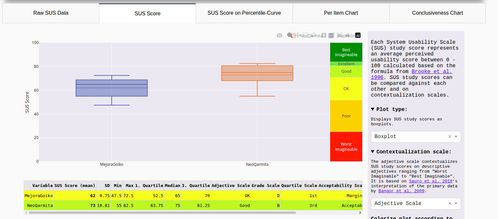

# Usability Report

### Evaluación de usabilidad del proyecto — Mejora de Goiko

**Fecha:** Mayo 2026

**Web del proyecto evaluado:** <https://goikomejorado.surge.sh>

**Repositorio GitHub del proyecto evaluado:** [https://github.com/ClaudioDevv/UX_CaseStudy](https://github.com/ClaudioDevv/UX_CaseStudy)

---

### Realizado por:

**Equipo DIU2.Errores404** — Julian Carrion Tovar ([@jxliian](https://github.com/jxliian)) y Miguel Angel Luque Gomez ([@mangel](https://github.com/mangel))

Somos un equipo de la asignatura Diseño de Interfaces de Usuario (DIU), curso 2025/26, con experiencia en investigación de usuarios, prototipado en Figma, evaluación heurística y pruebas de usabilidad con usuarios reales. A lo largo del curso hemos desarrollado nuestro propio caso de estudio (NeoQarmita — La Qarmita Cultura y Café) aplicando la misma metodología que empleamos aquí para evaluar el diseño del Caso B: A/B Testing, cuestionario SUS y Eye Tracking con GazeMapping.

---

## 1. Resumen Ejecutivo (Executive Summary)

- **Objetivo:** Evaluar la usabilidad del rediseño web del restaurante **Mejora de Goiko** (Caso B), desarrollado por el equipo [ClaudioDevv/UX_CaseStudy](https://github.com/ClaudioDevv/UX_CaseStudy). El propósito del rediseño es modernizar la presencia digital de Goiko, mejorando la navegación, la búsqueda de restaurantes, el proceso de reserva online y la visibilidad del menú. La evaluación se enmarca en un estudio comparativo (A/B Testing) frente a la propuesta NeoQarmita (Caso A), con el objetivo de identificar fortalezas y áreas de mejora antes de una hipotética puesta en producción.

- **Metodología:** Se ha empleado un enfoque mixto que combina:
  - **A/B Testing** con 5 usuarios reales asignados al Caso B (sesiones presenciales de 5–10 min)
  - **Cuestionario SUS** (System Usability Scale) de 10 ítems en escala Likert 1–5, administrado al finalizar la sesión mediante Tally.so
  - **Eye Tracking** con la herramienta GazeMapping sobre las pantallas principales del diseño
  - **Auditoría de accesibilidad** automática con WAVE y Google Lighthouse (escritorio y móvil) según el marco **WCAG 2.1 AA**

- **Principales Hallazgos:**
  1. **Invisibilidad del CTA de reserva:** El botón principal de reserva en la Landing Page no capta la atención del usuario. El Eye Tracking revela que la concentración de calor se centra en el hero y el logotipo, ignorando el elemento de conversión crítico.
  2. **Proceso de reserva excesivamente largo:** El formulario de pago y datos (tarea con 78s de tiempo medio) resulta el cuello de botella principal. Los usuarios con menor competencia digital (Pilar, 52 años) abandonaron parcialmente el flujo. El número de clics en la tarea de "elegir salsas" (9 clics medios) es el más alto de todas las tareas evaluadas.
  3. **Problemas estructurales de accesibilidad:** La web carece de estructura de encabezados semánticos (`<h1>`, `<h2>`) y de landmarks de página (`<main>`, `<nav>`, `<footer>`), incumpliendo el criterio WCAG 2.1 AA. El LCP en móvil de 28.3 segundos supone una barrera de uso grave en conexiones estándar.

- **Resultado Global:** Puntuación SUS media de **62.0** (Grade D · Percentil 1º). El diseño se sitúa en la categoría **"OK"** con aceptabilidad **Marginal** según la escala de Sauro & Lewis. Si bien el diseño es funcionalmente correcto para usuarios con alta competencia digital, no supera el umbral de "Aceptable" para el público general. Se recomienda una revisión de prioridad alta en el flujo de reserva, el CTA principal y la estructura HTML antes de considerar el diseño como listo para producción.

---

## 2. Metodología y Reclutamiento

### Perfil de los participantes

Se ha realizado un estudio entre-sujetos con **5 usuarios** asignados al Caso B (Mejora de Goiko). La muestra recoge un rango diverso de edades, niveles de competencia digital y dispositivos de acceso, para detectar problemas de usabilidad en distintos perfiles.

| Usuario       | Sexo/Edad | Ocupación     | Exp. TIC | Personalidad | Plataforma |
| :------------ | :-------- | :------------ | :------- | :----------- | :--------- |
| P06 — Elena   | M / 24    | Estudiante    | Alta     | Comparativa  | Portátil   |
| P07 — David   | H / 31    | Desarrollador | Alta     | Analítico    | Portátil   |
| P08 — Pilar   | M / 52    | Usuario final | Baja     | Cautelosa    | Tablet     |
| P09 — Roberto | H / 35    | Usuario final | Media    | Práctico     | Sobremesa  |
| P10 — Nadia   | M / 21    | Estudiante    | Media    | Visual       | Móvil      |

**Posibles situaciones conflictivas por usuario:**

- **P06 Elena:** Puede comparar inconscientemente con otras webs de restaurantes similares.
- **P07 David:** Puede frustrarse si detecta problemas técnicos o de rendimiento.
- **P08 Pilar:** Puede abandonar el flujo de reserva si hay demasiados pasos.
- **P09 Roberto:** Puede tener dificultades si la búsqueda de restaurante no es intuitiva.
- **P10 Nadia:** Puede perder interés si la web no está optimizada para móvil.

- **Edad media:** 32.6 años  
- **Nivel digital medio:** Medio-Alto (2 Alta, 2 Media, 1 Baja)  
- **Dispositivos:** 2 portátiles, 1 tablet, 1 sobremesa, 1 móvil

### Escenario de la prueba

Las sesiones se realizaron de forma **presencial**, con una duración de entre 5 y 10 minutos por usuario. Se propusieron 4 tareas concretas sobre las pantallas principales del diseño Mejora de Goiko:

1. Localiza el restaurante Goiko más cercano a tu ubicación.
2. Realiza una reserva online para 3 personas esta noche.
3. Consulta el menú y encuentra las opciones vegetarianas disponibles.
4. Encuentra la vía de contacto para atención al cliente o redes sociales.

Se anotó si el usuario completó la tarea sin ayuda, el tiempo empleado y el número de clics. Al finalizar se administró el cuestionario SUS.

### Herramientas utilizadas

| Herramienta | Propósito |
| :---------- | :-------- |
| **GazeMapping** | Eye Tracking: captura de mapas de calor sobre pantallas fijas del diseño |
| **FireShot** | Captura de las pantallas analizadas en Eye Tracking |
| **Tally.so** | Administración online del cuestionario SUS |
| **SUS Tools** (sus.tools) | Cálculo de puntuación y etiqueta SUS individual |
| **sus.mixality.de** | Análisis multivariable y comparativa A vs. B |
| **WAVE** | Auditoría automática de accesibilidad web |
| **Google Lighthouse / PageSpeed** | Auditoría de rendimiento, accesibilidad, SEO y buenas prácticas |

---

## 3. Resultados del Cuestionario SUS (Datos Cuantitativos)

### Respuestas por usuario

|    | Pregunta                                                                                    | P06 | P07 | P08 | P09 | P10 |
| :- | :------------------------------------------------------------------------------------------ | :-: | :-: | :-: | :-: | :-: |
| 1  | Creo que me gustará visitar con frecuencia este website                                     | 4   | 3   | 3   | 4   | 4   |
| 2  | Encontré el website innecesariamente complejo                                               | 2   | 2   | 3   | 3   | 3   |
| 3  | Pensé que era fácil utilizar este website                                                   | 4   | 4   | 3   | 3   | 3   |
| 4  | Creo que necesitaría del apoyo de un experto para recorrer el website                       | 2   | 2   | 3   | 2   | 2   |
| 5  | Encontré las funciones del website bastante bien integradas                                 | 4   | 3   | 2   | 4   | 3   |
| 6  | Pensé que había demasiada inconsistencia en el website                                      | 2   | 3   | 3   | 2   | 3   |
| 7  | Imagino que la mayoría de las personas aprenderían muy rápidamente a utilizar el website    | 4   | 4   | 3   | 4   | 4   |
| 8  | Encontré el website muy grande al recorrerlo                                                | 2   | 2   | 3   | 3   | 3   |
| 9  | Me sentí muy confiado/a en el manejo del website                                            | 3   | 4   | 3   | 3   | 3   |
| 10 | Necesito aprender muchas cosas antes de manejarme en el website                             | 2   | 2   | 3   | 2   | 3   |

### Puntuaciones individuales y comparativa

| Usuario        | Caso | Puntuación SUS | Etiqueta       |
| :------------- | :--- | :------------- | :------------- |
| P06 — Elena    | B    | 72.5           | Good           |
| P07 — David    | B    | 67.5           | OK             |
| P08 — Pilar    | B    | **47.5**       | Poor           |
| P09 — Roberto  | B    | 65.0           | OK             |
| P10 — Nadia    | B    | 57.5           | OK             |
| **Media Caso B** | — | **62.0**       | **OK / Marginal** |
| *Media Caso A (referencia)* | — | *73.0* | *Good / Acceptable* |

### Análisis multivariable

El análisis multivariable (sus.mixality.de) confirma que el Caso B (Mejora de Goiko) obtiene una media de **62.0** (SD 9.75), situándose en la categoría **OK** con aceptabilidad **Marginal**. La puntuación más baja corresponde a Pilar (P08, 47.5), usuaria con baja competencia digital que experimentó abandonos parciales en el flujo de reserva.

**Desglose por ítems problemáticos:**

- **Ítem 2 (Complejidad):** P08, P09 y P10 valoraron con 3 que el sitio es "innecesariamente complejo". Señal de sobrecarga en el proceso de pedido/reserva.
- **Ítem 5 (Integración de funciones):** P08 puntuó con 2, indicando que las funciones no están bien integradas. Coherente con la confusión observada en el flujo de personalización de la hamburguesa.
- **Ítem 6 (Inconsistencia):** P07 y P08 puntúan 3, reflejo de las inconsistencias de navegación detectadas por el perfil más analítico (David).
- **Ítem 8 (Tamaño excesivo):** P08, P09 y P10 puntúan 3, lo que indica que el sitio se percibe como extenso o difícil de recorrer, especialmente en dispositivos con pantalla reducida.

---

## 4. Análisis de Eye Tracking (Datos Biométricos)

El experimento se realizó con **GazeMapping**, capturando con **FireShot** las pantallas principales del diseño y definiendo Puntos de Interés (POI) sobre los elementos clave: CTA de reserva, barra de navegación, imagen hero, formulario de datos y botones de personalización.

### Mapas de calor

| Landing Page (Escritorio) | Landing Page (Móvil) | Personaliza tu Burger |
| :-----------------------: | :------------------: | :-------------------: |
|  |  |  |

| Carrito | Pago | Pago Finalizado |
| :-----: | :--: | :-------------: |
|  |  |  |

### Observaciones por pantalla

**Landing Page:**
- La concentración de calor más intensa se registra en la **imagen hero central** y en el **logotipo**. Sin embargo, el botón principal de reserva recibe muy poca atención visual, al estar ubicado en una posición que se confunde visualmente con el resto de la cabecera.
- **Hero Section sin CTA definido:** El hero no cuenta con un botón de llamada a la acción claramente diferenciado. El mapa de calor muestra que los usuarios fijan la vista en la imagen y el texto del hero pero no identifican ningún elemento accionable inmediato, lo que rompe el flujo de conversión desde la primera pantalla.
- **Zona de silencio crítica:** El CTA de reserva —el elemento de conversión más importante— es ignorado por la mayoría de usuarios en la primera exploración.

**Página de Reservas:**
- Los usuarios exploraron el formulario de forma **errática**. El selector de fecha y hora no fue identificado de inmediato: varios usuarios lo buscaron en la zona inferior de la pantalla antes de encontrarlo en la parte superior.
- Los perfiles con menor competencia digital (Pilar) mostraron patrones de exploración amplios y sin foco, indicando **desorientación en la arquitectura de información**.

**Footer:**
- Los iconos de redes sociales del footer fueron **ignorados por la totalidad de usuarios**, por lo que no funcionan como canal de contacto secundario.

**Personalización de hamburguesa:**
- El proceso de elección de salsas generó confusión al encontrarse en la última opción del flujo, lo que provocó abandono parcial en los perfiles de Pilar y Nadia.
- **Lista de opciones excesivamente larga:** El mapa de calor revela que los usuarios se pierden al enfrentarse a una lista extensa de ingredientes y extras sin agrupación visual clara. La atención se dispersa verticalmente por toda la pantalla sin anclar en ningún elemento concreto, lo que dificulta localizar la opción deseada y aumenta la carga cognitiva. Los usuarios con perfil menos técnico (Pilar, Nadia) muestran patrones de exploración erráticos que terminan en abandono parcial de la tarea.

### Hallazgo clave

> El 100% de los usuarios ignoró el botón CTA de reserva en la landing page durante la exploración inicial. Solo lo localizaron cuando se les indicó explícitamente la tarea, y en algunos casos con dificultad.

---

## 5. Auditoría de Accesibilidad

La auditoría se realizó sobre la web del Caso B ([https://goikomejorado.surge.sh](https://goikomejorado.surge.sh)) con dos herramientas automáticas: **WAVE** y **Google Lighthouse** (escritorio y móvil). Marco de referencia: **WCAG 2.1 nivel AA**.

### WAVE — Web Accessibility Evaluation Tool

WAVE no detectó ningún error crítico ni error de contraste, obteniendo una puntuación **AIM de 10/10**. Sin embargo, registró **2 alertas** relevantes:

- **Sin estructura de encabezados** (*No heading structure*): la página no utiliza etiquetas `<h1>`, `<h2>`, etc. de forma jerárquica. Impide que los usuarios de lectores de pantalla naveguen por secciones y que los motores de búsqueda identifiquen la jerarquía del contenido.
- **Sin regiones de página** (*No page regions*): no se han definido landmarks semánticos (`<header>`, `<main>`, `<nav>`, `<footer>`), dificultando la navegación por teclado y con tecnologías asistivas.

Como punto positivo, el idioma de la página está correctamente definido, lo que permite a los lectores de pantalla pronunciar el contenido en castellano.

### Google Lighthouse

*Escritorio*

*Móvil*

| Métrica          | Escritorio | Móvil |
| :--------------- | :--------: | :---: |
| Rendimiento      | 66 / 100   | 69 / 100 |
| Accesibilidad    | 87 / 100   | 82 / 100 |
| Recomendaciones  | 96 / 100   | 96 / 100 |
| SEO              | 58 / 100   | 58 / 100 |

### Análisis por categorías WCAG 2.1

**[Perceptible — WCAG 1.3.1]** Sin estructura de encabezados (`<h1>`, `<h2>`...)  
*Impacto:* Los usuarios con lector de pantalla no pueden identificar la jerarquía de contenido.  
*Recomendación:* Añadir etiquetas de encabezado semánticas y jerárquicas en todas las secciones.

**[Perceptible — WCAG 1.4.4]** LCP de 28.3s en móvil  
*Impacto:* Las imágenes pesadas bloquean la carga del contenido principal en conexiones estándar.  
*Recomendación:* Optimizar imágenes para móvil; usar formatos WebP y lazy loading.

**[Operable — WCAG 2.5.3]** CLS de 0.243 en escritorio  
*Impacto:* Desplazamiento visual durante la carga que puede provocar clics accidentales.  
*Recomendación:* Reservar espacio explícito para imágenes y elementos cargados de forma asíncrona.

**[Comprensible — WCAG 1.3.6]** Sin regiones de página (`<main>`, `<nav>`, `<footer>`)  
*Impacto:* La navegación por teclado o lector de pantalla carece de puntos de referencia.  
*Recomendación:* Añadir landmarks HTML5 semánticos en la estructura de la página.

**[Robusto — WCAG 4.1.1]** SEO 58/100; sin metadatos estructurados ni etiquetas semánticas  
*Impacto:* Los agentes de usuario y tecnologías asistivas no pueden interpretar correctamente la estructura.  
*Recomendación:* Añadir metaetiquetas descriptivas, `aria-label` en elementos interactivos y estructurar el HTML con roles ARIA.

**Valoración global de accesibilidad: 6/10** — Cumple los mínimos técnicos (sin errores críticos de contraste) pero requiere mejoras estructurales y de rendimiento para alcanzar el nivel AA de forma completa. El punto más crítico es el LCP de 28.3s en móvil, inaceptable para un sitio de restauración donde el usuario espera acceso inmediato al menú o a la reserva.

---

## 6. Conclusiones y Recomendaciones (Actionable Insights)

### Resultados del A/B Testing

| Tarea (Mejora de Goiko)             | % Éxito | Tiempo medio | Clics medios |
| :---------------------------------- | :------: | :----------: | :----------: |
| Pedir una hamburguesa               | 60 %     | 38 s         | 5            |
| Elegir salsas extra                 | 80 %     | 20 s         | 9            |
| Realizar pago y rellenado de datos  | 80 %     | 78 s         | 4            |
| Encontrar contacto y redes sociales | 100 %    | 18 s         | 3            |
| **Media general**                   | **80 %** | **38.5 s**   | **5**        |

**Valoración general media:** 4.0 / 7

### Recomendaciones priorizadas

**[Alta — Crítica]** El CTA de reserva en la Landing Page es ignorado por todos los usuarios (Eye Tracking).  
*Mejora:* Aumentar contraste, tamaño y posición del botón de reserva; destacarlo visualmente sobre el hero con color de alto contraste.

**[Alta — Crítica]** El flujo de reserva/pago tarda una media de 78s y genera abandono en usuarios con bajo nivel digital.  
*Mejora:* Simplificar el formulario de reserva: reducir campos visibles en la primera pantalla y dividir el proceso en pasos numerados.

**[Alta — Crítica]** LCP de 28.3s en móvil; el sitio no carga a tiempo para usuarios con conexión estándar.  
*Mejora:* Comprimir y servir imágenes en formato WebP; implementar lazy loading y caché de recursos estáticos.

**[Media]** Sin estructura de encabezados (`<h1>`, `<h2>`) ni landmarks HTML5 semánticos (WAVE).  
*Mejora:* Añadir jerarquía de encabezados y landmarks `<header>`, `<main>`, `<nav>`, `<footer>` para cumplir WCAG 2.1 AA.

**[Media]** La sección de elección de salsas está al final del flujo, generando 9 clics medios y abandono parcial.  
*Mejora:* Reposicionar la personalización de ingredientes antes del carrito; mostrar las opciones de forma más visual y accesible.

**[Media]** CLS de 0.243 en escritorio provoca clics accidentales durante la carga.  
*Mejora:* Reservar espacio explícito (height/width) en los elementos de imagen cargados de forma asíncrona.

**[Baja]** Los iconos de redes sociales del footer son ignorados por la totalidad de usuarios.  
*Mejora:* Acompañar los iconos con etiquetas de texto o integrar el bloque en una sección más visible de la página.

**[Baja]** SEO de 58/100; falta de metaetiquetas descriptivas y etiquetas semánticas.  
*Mejora:* Añadir `<title>`, `<meta description>`, `aria-label` en botones interactivos y datos estructurados (JSON-LD).

### Valoración final del equipo evaluador

El diseño de Mejora de Goiko presenta una propuesta visual moderna y atractiva, especialmente bien valorada por perfiles con alta competencia digital (Elena, David). La arquitectura general de la web es comprensible y el flujo de contacto funciona correctamente (100% de éxito, 18s).

Sin embargo, la usabilidad se resiente de forma significativa en cuanto el usuario tiene un perfil menos técnico o accede desde móvil. El cuello de botella principal es el proceso de reserva/pedido: demasiados pasos, tiempo excesivo (78s) y un CTA invisible en la pantalla de entrada. Estos problemas combinados explican la puntuación SUS de 62.0 (Marginal) y la diferencia de 11 puntos frente al Caso A.

Con las mejoras propuestas en prioridad Alta, el diseño podría alcanzar un rango **"Bueno" (SUS > 70)** y cumplir los requisitos mínimos de accesibilidad WCAG 2.1 AA, lo que lo convertiría en una base sólida para producción.

---

*Informe elaborado por el equipo DIU2.Errores404 — Asignatura Diseño de Interfaces de Usuario, Universidad de Granada, curso 2025/26.*
