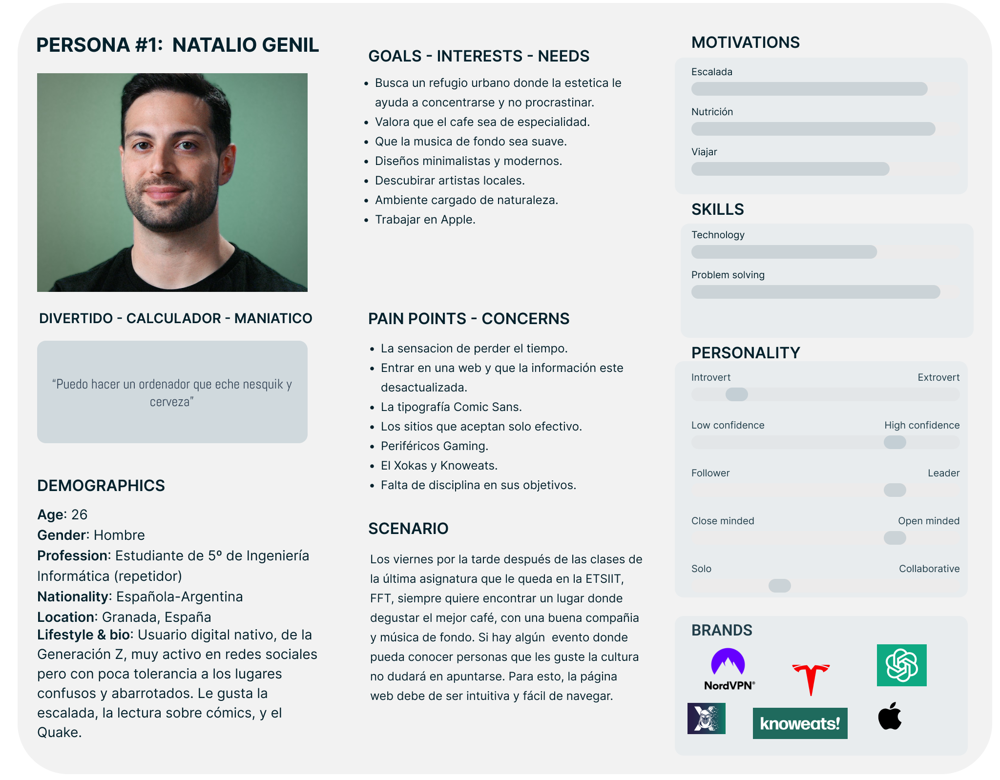
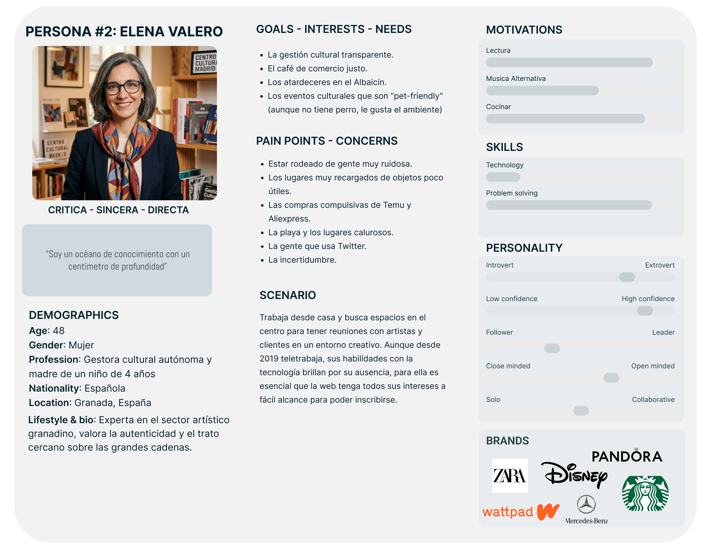
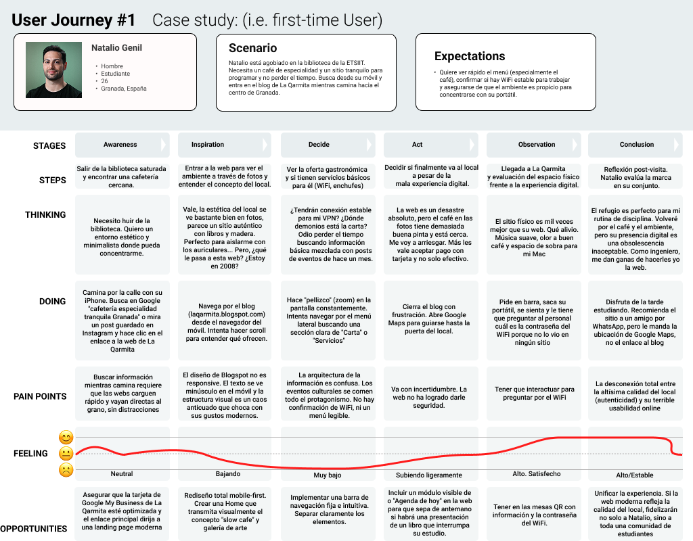
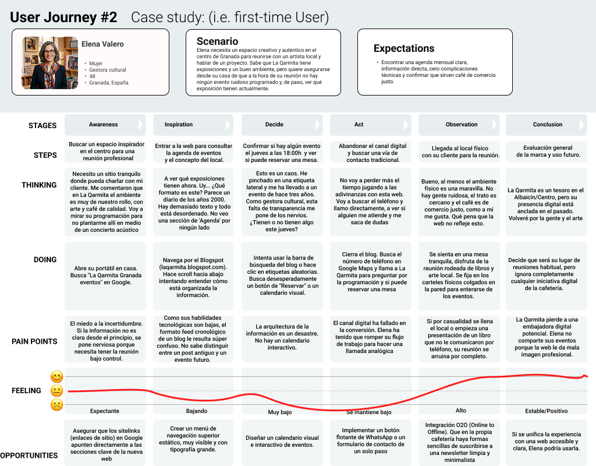

# DIU26
Prácticas Diseño Interfaces de Usuario (Tema: .... ) 

* [Guiones de prácticas](GuionesPracticas/)
* [Guía para crea tu Case Study](Guia_CaseStudy.md)
* Sala de la Fama [DIU Hall of fame](https://github.com/mgea/DIU/tree/master/hall_of_fame) donde se pueden encontrar Case Study destacados de otros años.

Actualizado: 14/01/2026

## Paso 0 My UX-Case Study
 
-----

Grupo: DIU2.Errores404.  Curso: 2025/26 

Nombre del Proyecto: La Qarmita - Cultura y Café

Descripción: 
Plataforma de gestión y promoción de experiencias culturales vinculadas al consumo de café de especialidad, basada en el caso de estudio de La Qarmita.

Logotipo: 
(Pendiente de diseño en P3)

Miembros y nombre del equipo:
 * :bust_in_silhouette:  Julian Carrion Tovar     :octocat: jxliian
 * :bust_in_silhouette:  Miguel Angel Luque Gomez     :octocat: mangel

----- 

 

# Proceso de Diseño 

 

## Paso 1. UX User & Desk Research & Analisis 

### 1.a User Reseach Plan
 
-----

**Briefing:**
La Qarmita es un espacio cultural híbrido en el corazón de Granada que fusiona los conceptos de cafetería de especialidad, librería y galería de arte. Su propuesta de valor se centra en ofrecer una experiencia "slow cafe", donde el cliente no solo consume café de autor y repostería artesanal, sino que se sumerge en un ambiente literario y artístico, con eventos como presentaciones de libros y exposiciones locales. Su público objetivo abarca desde estudiantes universitarios que buscan un lugar tranquilo para trabajar, hasta amantes de la cultura y el arte que valoran los espacios independientes y comunitarios.

A pesar de su fuerte identidad física y comunitaria, su presencia digital presenta retos significativos. La coexistencia de un blog antiguo (Blogspot) con una web más moderna pero limitada refleja una fragmentación en la experiencia del usuario online. No disponen de sistemas integrados de reserva, venta de libros e-commerce o una agenda de eventos interactiva clara. Esto penaliza la usabilidad y la conversión de usuarios que buscan interactuar con el espacio antes de visitarlo físicamente. Nuestra estrategia se centrará en analizar cómo unificar esta experiencia y potenciar la visibilidad de su oferta cultural única.

## User Research Plan (template)

## Descripción 

Este **User Research Plan** define la estrategia para evaluar la experiencia de usuario de **La Qarmita**, un espacio que combina café, libros y arte en Granada. El objetivo es identificar las fricciones en su ecosistema digital actual y sentar las bases para una propuesta de diseño unificada.

## Antecedentes y Objetivos (The "Why")

- **Contexto:** La Qarmita cuenta con una fuerte identidad física pero una presencia digital fragmentada (Blogspot vs Web principal). Evaluamos el estado actual para entender cómo los usuarios interactúan con su oferta cultural antes de visitar el local.
- **Objetivos de investigación:** Con este informe se busca identificar si los usuarios encuentran fácilmente la agenda de eventos culturales así como evaluar la facilidad para localizar información crítica (horarios, ubicación, menú) en el sitio de Blogspot y finalmente comprender la percepción del usuario sobre la dualidad "café-librería" a través de la interfaz.
- **Experiencia del equipo:** Basados en nuestra experiencia, creemos que la oferta de este tipo de servicios distintivos como complemento a servicios tradicionales como las cafeterías aportan un valor añadido que provoca una mayor atracción del cliente respecto a la competencia.

#### 2. Metodología (The "How")

- **Cualitativa:** Las entrevistas a clientes y la observación etnográfica son algunas de las técnicas más fiables y directas para obtener información de primera mano.

- **Cuantitativa:** Número de clientes nuevos semanal, medición de visitas a la web, estancia media en la web y en el local, gasto promedio de los clientes, número de reseñas positivas/neagativas en la web.

- **KPI Indicators:** Número de clics (¿Cuánto tarda el usuario en encontrar lo que busca?), tasa de rebote (nos dice si el usuario abandonó por no saber hacer de inmediato lo que tenía que hacer) ¿Logra el usuario lo que busca?

#### 3. Perfil de los Participantes (The "Who")
-Estudiantes (mayormente universitarios) que buscan relajarse en un sitio tranquilo para poder concentrarse o desconectar del trabajo.

-Personas que ven en la pausa para el café su pequeño espacio de desconexión diario.

-Apasionados de la literatura, la cultura y otras formas de arte que buscan lugares en los que rodearse de personas con gusto similar para compartir sus experiencias.

#### 4. Guion y Tareas (The "What")
Se pretende que los usuarios sean capaces de realizar las siguientes tareas:

- Buscar el horario de apertura del local para los fines de semana.
- Encontrar el nombre de la exposición actual en la Galería Qarmitera.
- Localizar la lista de precios de los desayunos o alguna especialidad de café concreta.
- Dejar una reseña en la página reflejando su experiencia con el servicio.

### 1.b Competitive Analysis
 
-----

Para el análisis competitivo, hemos comparado **La Qarmita** con otras dos propuestas destacadas de café de especialidad en Granada: **Despiertoo** (Tostadores locales) y **Noat Coffee** (Referente en Plaza de los Girones).

| Categoría | Características | La Qarmita | Despiertoo | Noat Coffee |
| :--- | :--- | :---: | :---: | :---: |
| **Business Model** | Precio / Suscripción | Bajo-Medio / Eventos | Medio-Alto / Mayorista | Alto / Especialidad |
| | | Fusión café y cultura | Suscripción café grano | Brunch y calidad alta |
| **Technological Issues** | 1º Presencia Digital | Obsoleta (Blogspot) | Moderna / Shopify | Instagram-First |
| | 2º Adaptabilidad | Muy baja (No responsive) | Alta (Mobile-friendly) | Media (External tools) |
| **Functionality & Usability** | 1º Reservas/Eventos | Manual / Muy confuso | Directo (Tienda online) | No disponible |
| | 2º Facilidad de uso | Baja (Ruido visual) | Alta (Interfaz limpia) | Alta (Social media) |
| **Others** | **Strength** | Identidad y comunidad | Calidad de tueste | Estética y ubicación |
| | **Weakness** | Infraestructura técnica | Suscripción limitada | Dependencia de terceros |
| | **Conclusions** | Requiere renovación total | Referente en e-commerce | Éxito sin web propia |

Hemos seleccionado **La Qarmita** como caso principal porque, a pesar de tener la oferta cultural más rica, su plataforma digital es la que presenta mayores retos. Despiertoo representa el estándar moderno de tienda online de café en la ciudad, mientras que Noat Coffee demuestra que un buen producto y ubicación pueden sostenerse con una presencia digital minimalista pero efectiva, remarcando lo que La Qarmita pierde por su falta de usabilidad técnica.

**Posicionamiento e Identidad**
La Qarmita compite con una propuesta de valor única basada en la "Fusión café y cultura" y un modelo de precio "Bajo-Medio". Su mayor fortaleza radica en la consolidación de su "Identidad y comunidad". Sus competidores, en cambio, apuntan a un ticket superior (Medio-Alto y Alto), enfocándose en la "Suscripción café grano" o en el "Brunch y calidad alta".

**Presencia y Distribución Digital**
El mayor contraste se encuentra en los canales de distribución de contenido. La gran debilidad de La Qarmita es su infraestructura técnica, al contar con una presencia digital obsoleta (basada en un blogspot) y una adaptabilidad muy baja. En cambio, Despiertoo domina este aspecto con una plataforma Moderna (Shopify) y una alta adaptabilidad móvil. Por su parte, Noat Coffee demuestra que es posible tener éxito externalizando su contenido al centrar su presencia en redes sociales de gran alcance como Instagram.

**Funcionalidad y Usabilidad (UX)**
La gestión del contenido interactivo en La Qarmita es deficiente; su sistema de reservas es manual y confuso, además presenta una escasa facilidad de uso debido al ruido visual(gran cantidad de imágenes, escaso orden). Despiertoo marca el estándar del sector con gestión directa (posee tienda online) y una interfaz limpia. Noat Coffee, aunque no dispone de reservas, mantiene una alta usabilidad a través del uso de redes sociales.

**Conclusiones y Oportunidades**
La principal brecha competitiva de La Qarmita es tecnológica. Como conclusión, el negocio requiere renovación total en este aspecto ya que el servicio del establecimiento es uno de sus puntos más fuertes. Para potenciar su fuerte comunidad, la estrategia debe enfocarse en migrar hacia una plataforma web propia y "responsive" que elimine la fricción en las interacciones y ofrezca una experiencia de usuario limpia, a la altura del estándar marcado por Despiertoo y de las expectativas de las nuevas generaciones.

### 1.c Personas
 
-----

Hemos diseñado dos perfiles de usuario que representan los segmentos clave de La Qarmita: el estudiante universitario que busca un espacio de estudio/ocio y la profesional del sector cultural interesada en el espacio artístico.

#### Persona 1: Natalio Genil

Natalio es un estudiante de Ingeniería Informática de 26 años que busca un "refugio" urbano tranquilo y con buena estética para concentrarse en sus estudios, valorando el café de calidad y la ausencia de ruidos molestos.

#### Persona 2: Elena Valero

Elena es una gestora cultural de 48 años que busca espacios auténticos para reuniones y colaboraciones artísticas, interesándose por la accesibilidad del local y la claridad en la agenda de eventos culturales.

### 1.d User Journey Map
 
----

Hemos seleccionado dos situaciones habituales que reflejan los problemas de usabilidad detectados en la presencia digital de La Qarmita.

#### Business Case 1: Natalio buscando un refugio para el estudio

Este mapa describe la experiencia de Natalio al intentar encontrar información sobre el local desde su móvil, destacando las frustraciones causadas por una web no adaptada a dispositivos móviles.

#### Business Case 2: Elena organizando una reunión cultural

Elena experimenta dificultades al intentar coordinar una reunión y proponer una exposición, enfrentándose a una arquitectura de información confusa que mezcla contenido irrelevante con la agenda cultural.

### 1.e Usability Review
 
----

- **Enlace al documento:** [Usability-review-template.xlsx](./P1/Usability-review-template.xlsx) 
- **URL analizada:** https://laqarmita.blogspot.com/
- **Valoración numérica:** 45/100 (Rango: Pobre)
- **Comentario sobre la revisión:** 
La principal debilidad de La Qarmita es su obsolescencia técnica. Al basarse en una plantilla de Blogspot, no cumple con los estándares modernos de **diseño responsive** (imprescindible hoy en día). La arquitectura de la información es confusa; los eventos culturales, que son su mayor valor, se pierden en un feed cronológico difícil de navegar. Como puntos fuertes, destaca la **autenticidad** de su contenido y la claridad en la identidad de marca, pero falla en la conversión y en facilitar tareas básicas como consultar el menú o contactar para reservas.

 

## Paso 2. UX Design  

### 2.a Reframing / IDEACION: Feedback Capture Grid / EMpathy map 
 
----

>>> Comenta con un diagrama los aspectos más destacados a modo de conclusion de la práctica anterior. De qué carece la competencia?? Tu diagrama puede ser una figura subida a la carpeta P2/

 Interesante | Críticas     
| ------------- | -------
  Preguntas | Nuevas ideas
  
    
>>> Explica el Problema y plantea una hipótesis. Es decir, explica aquí qué 
>>> se plantea como "propuesta de valor" para un nuevo diseño de aplicación propio

### 2.b ScopeCanvas

----

>>> Propuesta de valor, pero ahora en vez de un texto es un ScopeCanvas que has subido a P2/ y enlazado desde aqui. Tambien vale una imagen miniatura del recurso.
>>> No olvides que tu propuesta ya tiene un nombre corto y puedes actualizar la cabecera de este archivo

### 2.b User Flow (task) analysis 
 
-----

>>> Definir "User Map" y "Task Flow" ... enlazar desde P2/ y describir brevemente

### 2.c IA: Sitemap + Labelling 
 
----

>>> Identificar términos para diálogo con usuario (evita el spanglish) y la arquitectura de la información. Es muy apropiado un diagrama tipo sitemap y una tabla que se ampliaría para llevar asociado la columna iconos (tanto para la web como para una app). 

Término | Significado     
| ------------- | -------
  Login  | acceder a plataforma

### 2.d Wireframes
 
-----

>>> Plantear el diseño del layout para Web/movil (organización y simulación). Describa la herramienta usada 

 

## Paso 3. Mi UX-Case Study (diseño)

### 3.a Moodboard

-----

>>> Diseño visual con una guía de estilos visual (moodboard) 
>>> Incluir Logotipo. Todos los recursos estarán subidos a la carpeta P3/
>>> Explique aqui la/s herramienta/s utilizada/s y el por qué de la resolución empleada. Reflexione ¿Se puede usar esta imagen como cabecera de Instagram, por ejemplo, o se necesitan otras?

### 3.b Landing Page
 
----

>>> Plantear el Landing Page del producto. Aplica estilos definidos en el moodboard

### 3.c Guidelines
 
----

>>> Estudio de Guidelines y explicación de los Patrones IU a usar 
>>> Es decir, tras documentarse, muestre las deciones tomadas sobre Patrones IU a usar para la fase siguiente de prototipado. 

### 3.d Mockup
 
----

>>> Consiste en tener un Layout en acción. Un Mockup es un prototipo HTML que permite simular tareas con estilo de IU seleccionado. Muy útil para compartir con stakeholders

 

## Paso 4. Pruebas de Evaluación 

### 4.a Reclutamiento de usuarios 

-----

>>> Breve descripción del caso asignado (llamado Caso-B) con enlace al repositorio Github
>>> Tabla y asignación de personas ficticias (o reales) a las pruebas. Exprese las ideas de posibles situaciones conflictivas de esa persona en las propuestas evaluadas. Mínimo 4 usuarios: asigne 2 al Caso A y 2 al caso B.

| Usuarios | Sexo/Edad     | Ocupación   |  Exp.TIC    | Personalidad | Plataforma | Caso
| ------------- | -------- | ----------- | ----------- | -----------  | ---------- | ----
| User1's name  | H / 18   | Estudiante  | Media       | Introvertido | Web.       | A 
| User2's name  | H / 18   | Estudiante  | Media       | Timido       | Web        | A 
| User3's name  | M / 35   | Abogado     | Baja        | Emocional    | móvil      | B 
| User4's name  | H / 18   | Estudiante  | Media       | Racional     | Web        | B 

### 4.b Diseño de las pruebas 
 
-----

>>> Planifique qué pruebas se van a desarrollar. ¿En qué consisten? ¿Se hará uso del checklist de la P1?

### 4.c Cuestionario SUS
 
----

>>> Como uno de los test para la prueba A/B testing, usaremos el **Cuestionario SUS** que permite valorar la satisfacción de cada usuario con el diseño utilizado (casos A o B). Para calcular la valoración numérica y la etiqueta linguistica resultante usamos la [hoja de cálculo](https://github.com/mgea/DIU19/blob/master/Cuestionario%20SUS%20DIU.xlsx). Previamente conozca en qué consiste la escala SUS y cómo se interpretan sus resultados
http://usabilitygeek.com/how-to-use-the-system-usability-scale-sus-to-evaluate-the-usability-of-your-website/)
Para más información, consultar aquí sobre la [metodología SUS](https://cui.unige.ch/isi/icle-wiki/_media/ipm:test-suschapt.pdf)
>>> Adjuntar en la carpeta P4/ el excel resultante y describa aquí la valoración personal de los resultados 

### 4.d A/B Testing
 
-----

>>> Los resultados de un A/B testing con 3 pruebas y 2 casos o alternativas daría como resultado una tabla de 3 filas y 2 columnas, además de un resultado agregado global. Especifique con claridad el resultado: qué caso es más usable, A o B?

### 4.e Aplicación del método Eye Tracking 

----

>>> Indica cómo se diseña el experimento y se reclutan los usuarios. Explica la herramienta / uso de gazerecorder.com u otra similar. Aplíquese únicamente al caso B.

  
>>> Cambiar esta img por una de vuestro experimento. El recurso deberá estar subido a la carpeta P4/  

>>> gazerecorder en versión de pruebas puede estar limitada a 3 usuarios para generar mapa de calor (crédito > 0 para que funcione) 

### 4.f Usability Report de B
 
-----

>>> Añadir report de usabilidad para práctica B (la de los compañeros) aportando resultados y valoración de cada debilidad de usabilidad. 
>>> Enlazar aqui con el archivo subido a P4/ que indica qué equipo evalua a qué otro equipo.

>>> Complementad el Case Study en su Paso 4 con una Valoración personal del equipo sobre esta tarea

 

## Paso 5. Exportación y Documentación 

### 5.a Exportación a HTML/React
 
----

>>> Breve descripción de esta tarea. Las evidencias de este paso quedan subidas a P5/

### 5.b Documentación con Storybook

----

>>> Breve descripción de esta tarea. Las evidencias de este paso quedan subidas a P5/

 

## Conclusiones finales & Valoración de las prácticas

>>> Opinión FINAL del proceso de desarrollo de diseño siguiendo metodología UX y valoración (positiva /negativa) de los resultados obtenidos. ¿Qué se puede mejorar? Recuerda que este tipo de texto se debe eliminar del template que se os proporciona 

