# DIU26
Prácticas Diseño Interfaces de Usuario (Tema: .... ) 

* [Guiones de prácticas](GuionesPracticas/)
* [Guía para crea tu Case Study](Guia_CaseStudy.md)
* Sala de la Fama [DIU Hall of fame](https://github.com/mgea/DIU/tree/master/hall_of_fame) donde se pueden encontrar Case Study destacados de otros años.
* [Recursos/plantillas en figma](https://www.figma.com/design/BN2IR0q2clOSplfMmalh9K/DIU_Toolkit_Framework--2026-)

Actualizado: 14/01/2026

## Paso 0 My UX-Case Study
 
-----

Grupo: DIU2.Errores404.  Curso: 2025/26 

Nombre del Proyecto: La Qarmita - Cultura y Café - El cambio de paradigma

Descripción: 
Plataforma de gestión y promoción de experiencias culturales vinculadas al consumo de café de especialidad, basada en el caso de estudio de La Qarmita. Se busca un cambio de paradigma no solo en la web sino en la forma de fidelizar a los nuevos clientes.

Logotipo: 
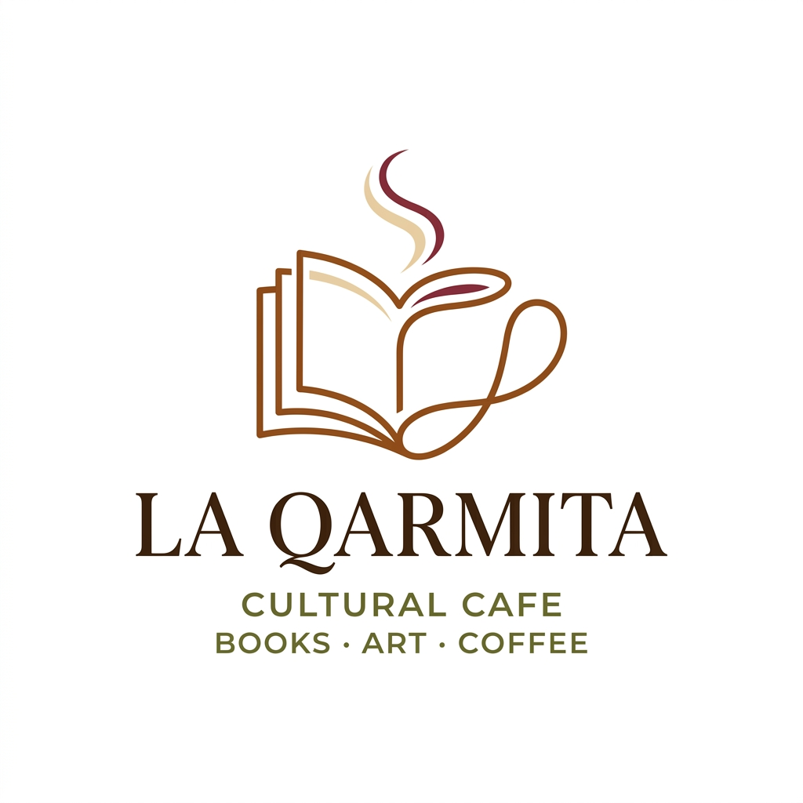

Miembros y nombre del equipo:
 * :bust_in_silhouette:  Julian Carrion Tovar     :octocat: jxliian
 * :bust_in_silhouette:  Miguel Angel Luque Gomez     :octocat: mangel

----- 

 

# Proceso de Diseño 

 

## Paso 1. UX User & Desk Research & Analisis 

### 1.a User Reseach Plan
 
-----

**Briefing:**
La Qarmita es un espacio cultural híbrido en el corazón de Granada que fusiona los conceptos de cafetería de especialidad, librería y galería de arte. Su propuesta de valor se centra en ofrecer una experiencia "slow cafe", donde el cliente no solo consume café de autor y repostería artesanal, sino que se sumerge en un ambiente literario y artístico, con eventos como presentaciones de libros y exposiciones locales. Su público objetivo abarca desde estudiantes universitarios que buscan un lugar tranquilo para trabajar, hasta amantes de la cultura y el arte que valoran los espacios independientes y comunitarios.

A pesar de su fuerte identidad física y comunitaria, su presencia digital presenta retos significativos. La coexistencia de un blog antiguo (Blogspot) con una web más moderna pero limitada refleja una fragmentación en la experiencia del usuario online. No disponen de sistemas integrados de reserva, venta de libros e-commerce o una agenda de eventos interactiva clara. Esto penaliza la usabilidad y la conversión de usuarios que buscan interactuar con el espacio antes de visitarlo físicamente. Nuestra estrategia se centrará en analizar cómo unificar esta experiencia y potenciar la visibilidad de su oferta cultural única.

## User Research Plan (template)

## Descripción 

Este **User Research Plan** define la estrategia para evaluar la experiencia de usuario de **La Qarmita**, un espacio que combina café, libros y arte en Granada. El objetivo es identificar las fricciones en su ecosistema digital actual y sentar las bases para una propuesta de diseño unificada.

## Antecedentes y Objetivos (The "Why")

- **Contexto:** La Qarmita cuenta con una fuerte identidad física pero una presencia digital fragmentada (Blogspot vs Web principal). Evaluamos el estado actual para entender cómo los usuarios interactúan con su oferta cultural antes de visitar el local.
- **Objetivos de investigación:** Con este informe se busca identificar si los usuarios encuentran fácilmente la agenda de eventos culturales así como evaluar la facilidad para localizar información crítica (horarios, ubicación, menú) en el sitio de Blogspot y finalmente comprender la percepción del usuario sobre la dualidad "café-librería" a través de la interfaz.
- **Experiencia del equipo:** Basados en nuestra experiencia, creemos que la oferta de este tipo de servicios distintivos como complemento a servicios tradicionales como las cafeterías aportan un valor añadido que provoca una mayor atracción del cliente respecto a la competencia.

#### 2. Metodología (The "How")

- **Cualitativa:** Las entrevistas a clientes y la observación etnográfica son algunas de las técnicas más fiables y directas para obtener información de primera mano.

- **Cuantitativa:** Número de clientes nuevos semanal, medición de visitas a la web, estancia media en la web y en el local, gasto promedio de los clientes, número de reseñas positivas/neagativas en la web.

- **KPI Indicators:** Número de clics (¿Cuánto tarda el usuario en encontrar lo que busca?), tasa de rebote (nos dice si el usuario abandonó por no saber hacer de inmediato lo que tenía que hacer) ¿Logra el usuario lo que busca?

#### 3. Perfil de los Participantes (The "Who")
-Estudiantes (mayormente universitarios) que buscan relajarse en un sitio tranquilo para poder concentrarse o desconectar del trabajo.

-Personas que ven en la pausa para el café su pequeño espacio de desconexión diario.

-Apasionados de la literatura, la cultura y otras formas de arte que buscan lugares en los que rodearse de personas con gusto similar para compartir sus experiencias.

#### 4. Guion y Tareas (The "What")
Se pretende que los usuarios sean capaces de realizar las siguientes tareas:

- Buscar el horario de apertura del local para los fines de semana.
- Encontrar el nombre de la exposición actual en la Galería Qarmitera.
- Localizar la lista de precios de los desayunos o alguna especialidad de café concreta.
- Dejar una reseña en la página reflejando su experiencia con el servicio.

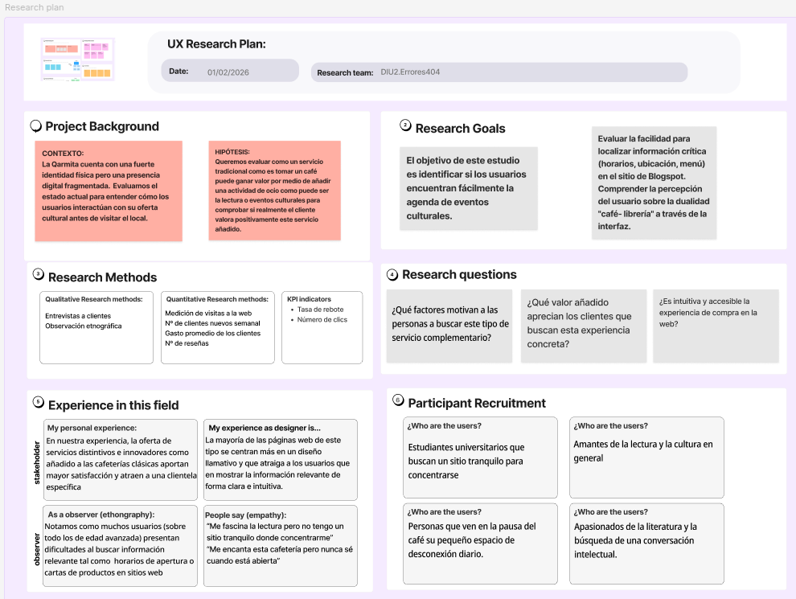

### 1.b Competitive Analysis
 
-----

Para el análisis competitivo, hemos comparado **La Qarmita** con otras dos propuestas destacadas de café de especialidad en Granada: **Despiertoo** (Tostadores locales) y **Noat Coffee** (Referente en Plaza de los Girones).

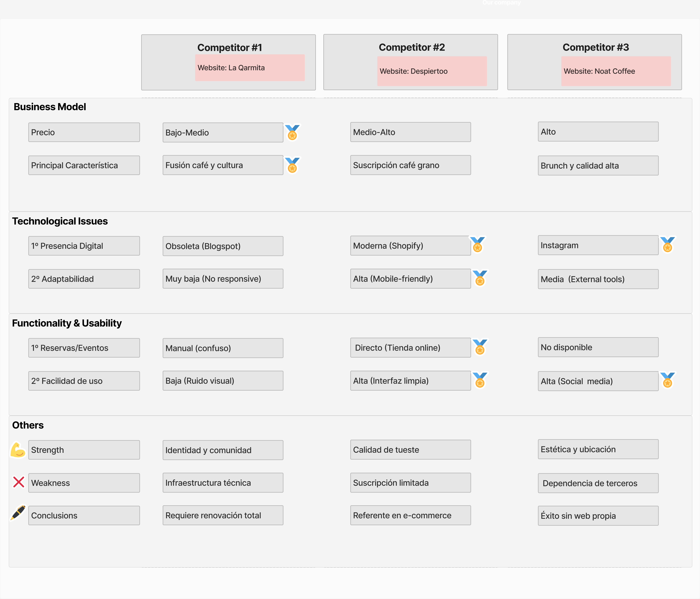

<!-- 
| Categoría | Características | La Qarmita | Despiertoo | Noat Coffee |
| :--- | :--- | :---: | :---: | :---: |
| **Business Model** | Precio / Suscripción | Bajo-Medio / Eventos | Medio-Alto / Mayorista | Alto / Especialidad |
| | | Fusión café y cultura | Suscripción café grano | Brunch y calidad alta |
| **Technological Issues** | 1º Presencia Digital | Obsoleta (Blogspot) | Moderna / Shopify | Instagram-First |
| | 2º Adaptabilidad | Muy baja (No responsive) | Alta (Mobile-friendly) | Media (External tools) |
| **Functionality & Usability** | 1º Reservas/Eventos | Manual / Muy confuso | Directo (Tienda online) | No disponible |
| | 2º Facilidad de uso | Baja (Ruido visual) | Alta (Interfaz limpia) | Alta (Social media) |
| **Others** | **Strength** | Identidad y comunidad | Calidad de tueste | Estética y ubicación |
| | **Weakness** | Infraestructura técnica | Suscripción limitada | Dependencia de terceros |
| | **Conclusions** | Requiere renovación total | Referente en e-commerce | Éxito sin web propia | -->

Hemos seleccionado **La Qarmita** como caso principal porque, a pesar de tener la oferta cultural más rica, su plataforma digital es la que presenta mayores retos. Despiertoo representa el estándar moderno de tienda online de café en la ciudad, mientras que Noat Coffee demuestra que un buen producto y ubicación pueden sostenerse con una presencia digital minimalista pero efectiva, remarcando lo que La Qarmita pierde por su falta de usabilidad técnica.

**Posicionamiento e Identidad**
La Qarmita compite con una propuesta de valor única basada en la "Fusión café y cultura" y un modelo de precio "Bajo-Medio". Su mayor fortaleza radica en la consolidación de su "Identidad y comunidad". Sus competidores, en cambio, apuntan a un ticket superior (Medio-Alto y Alto), enfocándose en la "Suscripción café grano" o en el "Brunch y calidad alta".

**Presencia y Distribución Digital**
El mayor contraste se encuentra en los canales de distribución de contenido. La gran debilidad de La Qarmita es su infraestructura técnica, al contar con una presencia digital obsoleta (basada en un blogspot) y una adaptabilidad muy baja. En cambio, Despiertoo domina este aspecto con una plataforma Moderna (Shopify) y una alta adaptabilidad móvil. Por su parte, Noat Coffee demuestra que es posible tener éxito externalizando su contenido al centrar su presencia en redes sociales de gran alcance como Instagram.

**Funcionalidad y Usabilidad (UX)**
La gestión del contenido interactivo en La Qarmita es deficiente; su sistema de reservas es manual y confuso, además presenta una escasa facilidad de uso debido al ruido visual(gran cantidad de imágenes, escaso orden). Despiertoo marca el estándar del sector con gestión directa (posee tienda online) y una interfaz limpia. Noat Coffee, aunque no dispone de reservas, mantiene una alta usabilidad a través del uso de redes sociales.

**Conclusiones y Oportunidades**
La principal brecha competitiva de La Qarmita es tecnológica. Como conclusión, el negocio requiere renovación total en este aspecto ya que el servicio del establecimiento es uno de sus puntos más fuertes. Para potenciar su fuerte comunidad, la estrategia debe enfocarse en migrar hacia una plataforma web propia y "responsive" que elimine la fricción en las interacciones y ofrezca una experiencia de usuario limpia, a la altura del estándar marcado por Despiertoo y de las expectativas de las nuevas generaciones.

### 1.c Personas
 
-----

Hemos diseñado dos perfiles de usuario que representan los segmentos clave de La Qarmita: el estudiante universitario que busca un espacio de estudio/ocio y la profesional del sector cultural interesada en el espacio artístico.

#### Persona 1: Natalio Genil

Natalio es un estudiante de Ingeniería Informática de 26 años que busca un "refugio" urbano tranquilo y con buena estética para concentrarse en sus estudios, valorando el café de calidad y la ausencia de ruidos molestos.

#### Persona 2: Elena Valero

Elena es una gestora cultural de 48 años que busca espacios auténticos para reuniones y colaboraciones artísticas, interesándose por la accesibilidad del local y la claridad en la agenda de eventos culturales.

### 1.d User Journey Map
 
----

Hemos seleccionado dos situaciones habituales que reflejan los problemas de usabilidad detectados en la presencia digital de La Qarmita.

#### Business Case 1: Natalio buscando un refugio para el estudio

Este mapa describe la experiencia de Natalio al intentar encontrar información sobre el local desde su móvil, destacando las frustraciones causadas por una web no adaptada a dispositivos móviles.

#### Business Case 2: Elena organizando una reunión cultural

Elena experimenta dificultades al intentar coordinar una reunión y proponer una exposición, enfrentándose a una arquitectura de información confusa que mezcla contenido irrelevante con la agenda cultural.

### 1.e Usability Review
 
----

- **Enlace al documento:** [Usability-review-PDF](./P1/Usability-review-template_hecho.pdf) 
- **URL analizada:** https://laqarmita.blogspot.com/
- **Valoración numérica:** 46/100 (Rango: Pobre)
- **Comentario sobre la revisión:** 
La principal debilidad de La Qarmita es su obsolescencia técnica. Al basarse en una plantilla de Blogspot, no cumple con los estándares modernos. A continuación se detallan los hallazgos principales:

#### Puntos Fuertes (Fortalezas)
*   **Propuesta de Valor Clara:** Identificación inmediata del concepto híbrido (Café + Libros + Cultura) al acceder al sitio.
*   **Contenido Visual Auténtico:** El uso de material gráfico propio del local transmite fielmente su atmósfera y genera confianza.
*   **Transparencia y Filosofía:** La sección de historia y valores ayuda a conectar emocionalmente con el público objetivo.

#### Contras (Debilidades / Puntos de Dolor)
*   **Nula Adaptabilidad (Responsive):** Experiencia de usuario fracturada en móviles; elementos superpuestos y navegación muy difícil.
*   **Arquitectura de Información Lineal:** La estructura de blog entierra información crítica (menú, precios, contacto) bajo posts cronológicos.
*   **Inaccesibilidad de la Agenda Cultural:** Falta de un calendario interactivo; los eventos son difíciles de localizar y consultar por fechas futuras.
*   **Baja Conversión:** Ausencia de llamadas a la acción directas para reservas, compra de libros o suscripción a eventos.
*   **Obsolescencia Técnica:** Limitación en la velocidad de carga e interactividad debido a la infraestructura técnica anticuada.

### 1.f Briefing

La Qarmita ofrece una experiencia única y valiosa en el mundo real, fusionando café de especialidad, libros y arte. Sin embargo, su escaparate digital principal (un Blogspot obsoleto) no refleja esta calidad y supone una barrera de entrada. Para el usuario moderno, la web resulta confusa, poco inmersiva, difícil de navegar en dispositivos móviles y no visibiliza adecuadamente la oferta dinámica del local, como su agenda de eventos, exposiciones y talleres. La web presenta una arquitectura de información que entierra realmente la información crítica de la web, además se ve limitada por la velocidad de carga e interactividad de la infraestructura técnica anticuada.

Existe una discrepancia enorme entre el "producto" físico (excelente) y el "producto" digital (deficiente). Rediseñando integralmente la plataforma online, tenemos la oportunidad no solo de arreglar la usabilidad básica, sino de crear una herramienta que potencie el ecosistema de La Qarmita. Al construir un entorno web moderno, dinámico y "Mobile-First", podemos transformar a visitantes curiosos en clientes habituales y promover la participación activa en su oferta cultural.

 

## Paso 2. UX Design  

### 2.a Reframing / IDEACION: Empathy Map 
----

A partir de la experiencia adquirida en el análisis de competidores y el journey de nuestros usuarios, hemos sintetizado los hallazgos empleando un **Mapa de Empatía** general que engloba a nuestras Personas principales. Esta herramienta nos ayuda a entender mejor qué dicen, piensan, hacen y sienten, permitiendo identificar puntos clave (*pains & gains*) para nuestra nueva propuesta de valor. La propuesta se enfoca en resolver las carencias tecnológicas de la competencia directa solucionando el ruido visual y mejorando los canales de información.

#### Mapa de Empatía General

**Problema e Hipótesis:**
La principal carencia actual es la infraestructura técnica y la fragmentación digital de la experiencia. Nuestra hipótesis se fundamenta en que una unificación del ecosistema digital de La Qarmita, que ofrezca una navegación intuitiva y una agenda centralizada (*Mobile-First*), eliminará la fricción en la interacción del usuario e impulsará el alcance de la comunidad artística y cultural local. Además de un modelo de subscripción para fidelizar a los usuarios.

### 2.b ScopeCanvas

----

En este ScopeCanvas detallamos la propuesta de valor para **La Qarmita**, centrada en unificar su experiencia física y digital, además del establecimiento de otras medidas como el "sistema de recompensas". Definimos los propósitos y métricas de nuestro proyecto, alineando las necesidades de los usuarios (como estudiantes y gestores culturales) con los objetivos de negocio.

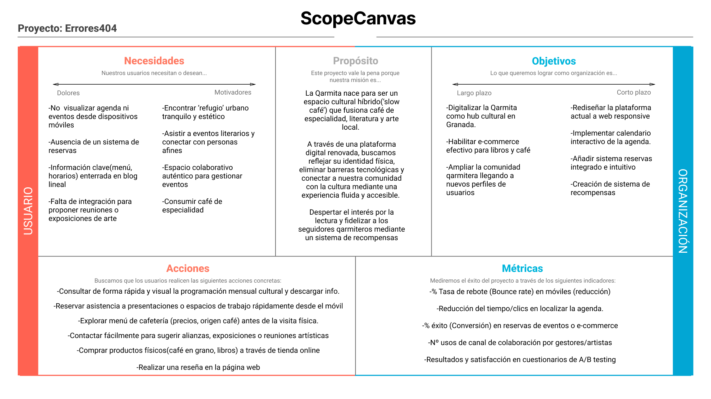

### 2.b User Flow (task) analysis 
 
-----

**User Task Matrix**

En nuestra matriz de tareas de usuario, hemos recopilado las funciones principales que la plataforma debe ofrecer y hemos evaluado la relevancia de cada una para nuestros distintos públicos. Para ello, hemos definido tres grupos clave basándonos en las Personas y los roles del sistema, asignando prioridades de Alta (H), Media (M) y Baja (L), o usando un guión (-) si la acción no aplica.

| Acción / Función | Cliente Habitual (Natalio) | Nuevo Cliente (Elena) | Administrador |
| :---------------- | :------------------------: | :-----------------------: | :-------------: |
| Iniciar sesión / Registrarse | H | H | H |
| Consultar horario, ubicación y afluencia | M | H | L |
| Ver menú y carta de cafés de especialidad | H | M | L |
| Ver agenda de eventos y exposiciones | H | H | L |
| Reservar una mesa / espacio de estudio | H | H | - |
| Suscribirse al plan de fidelización | H | L | - |
| Comprar en la tienda online (Café/Libros) | M | L | - |
| Proponer un evento o exposición artística | - | H | - |
| Gestionar y Aprobar agenda cultural | - | - | H |
| Publicar nuevo producto en la tienda/menú | - | - | H |
| Dejar una reseña o comentario | M | M | - |
| Editar perfil y preferencias de alertas | H | H | H |
| Contactar con soporte / Resolver dudas | L | M | H |

 

**User / Task Flow**

A continuación se muestran los diagramas de flujo para las tareas principales seleccionadas, detallando el recorrido paso a paso que realiza el usuario para completarlas.

#### Taskflow 1
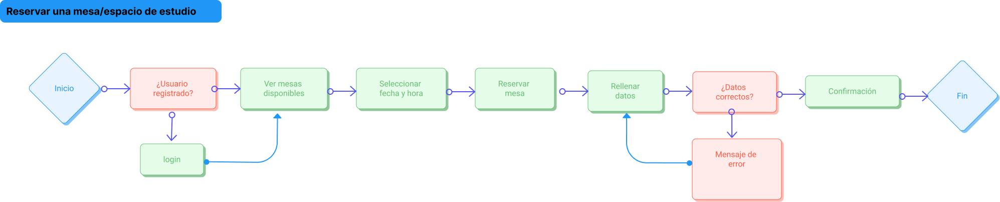

#### Taskflow 2
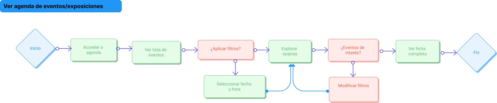

### 2.c IA: Sitemap + Labelling 
 
----

<!-- >>> Identificar términos para diálogo con usuario (evita el spanglish) y la arquitectura de la información. Es muy apropiado un diagrama tipo sitemap y una tabla que se ampliaría para llevar asociado la columna iconos (tanto para la web como para una app).  -->

* **Sitemap**

<!-- Este sitemap es orientativo, mangel debera de cambiarlo por el que haga el bien -->
<!-- Te recomiendo que veas los de otros años para que veas como hacerlo 
Lo ideal seria que fuera un arbol con profundidad +2 pq ahora solo tiene profundidad 2 -->

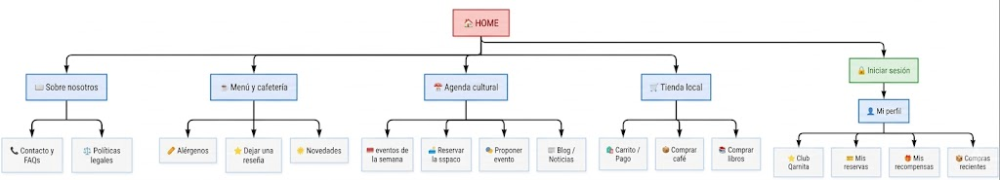

* **Labelling**

| Término | Significado | Icono |
| :------- | :---------- | :---: |
| Inicio | Página principal que da acceso a todas las secciones de La Qarmita | 🏠 |
| Sobre Nosotros | Historia, ubicación, horarios y concepto del local (Café & Cultura) | 📖 |
| Menú / Carta | Catálogo detallado de cafés de especialidad, tés y repostería artesanal | ☕ |
| Alérgenos | Información de ingredientes, trazas e intolerancias del menú de comida | 🥜 |
| Agenda Cultural | Calendario interactivo con eventos, exposiciones y talleres próximos | 📅 |
| Detalle del Evento | Página de un evento específico con información de autores o entradas | 🎟️ |
| Novedades / Blog | Noticias de La Qarmita, artículos sobre café y crónicas de exposiciones | 📰 |
| Reservar Mesa | Sección para solicitar reserva de una mesa o un espacio de estudio/reunión | 🛋️ |
| Tienda Local | Espacio para comprar café en grano, libros y merchandising | 🛒 |
| Club Qarmita | Información y suscripción al plan de fidelización/recompensas del local | 🌟 |
| Proponer Evento | Formulario para que artistas y gestores culturales propongan actividades | 🎭 |
| Preguntas Frecuentes | Resolución de dudas sobre espacios, métodos de pago y reservas (FAQ) | ❓ |
| Contacto | Canales de comunicación directa, redes sociales y mapa de ubicación | 📞 |
| Políticas Legales | Términos de uso, política de privacidad y condiciones de venta | ⚖️ |
| Iniciar Sesión / Registro | Acceso privado a la plataforma para clientes y organizadores | 👤 |
| Recuperar Contraseña | Proceso automatizado para restablecer el acceso a la cuenta | 🔑 |
| Mi Perfil | Gestión de preferencias de alertas, datos personales, y configuración | ⚙️ |
| Mis Favoritos | Lista de deseos del usuario para guardar libros, eventos o cafés de interés | ❤️ |
| Mis Reservas | Apartado interno del perfil para consultar las reservas de mesas o eventos | 🎫 |
| Historial de Compras | Registro de pedidos previos en la tienda online y seguimiento de envíos | 📦 |
| Carrito | Resumen de los artículos/libros seleccionados listos para proceder al pago | 🛍️ |
| Reseñas | Espacio interactivo para que los usuarios valoren su experiencia y opinen | ⭐ |
| Panel de Control | (Admin) Gestión interna completa de la agenda cultural, tienda y usuarios | 🔒 |
| Cerrar Sesión | Opción para finalizar de forma segura la sesión iniciada en el sistema | 🚪 |

### 2.d Wireframes
 
-----

En esta sección detallamos el diseño del layout en su versión desarrollado con la herramienta **Figma**, enfocándonos en la organización y simulación de la interfaz. Estos wireframes de baja fidelidad (Lo-Fi) nos ayudan a establecer la jerarquía visual de la información y la disposición de las funcionalidades básicas.

Puedes consultar el diseño completo y los primeros acercamientos en el siguiente enlace:
🔗 **[Ver bocetos de los wireframes (PDF)](./P2/Entrega/Wireframe_boceto.pdf)**

A continuación, exponemos las vistas principales del rediseño:

#### Home (Página Principal)
La pantalla de inicio busca distribuir a los usuarios hacia las áreas clave de La Qarmita: próximos eventos, reservas y productos destacados de su tienda o carta.
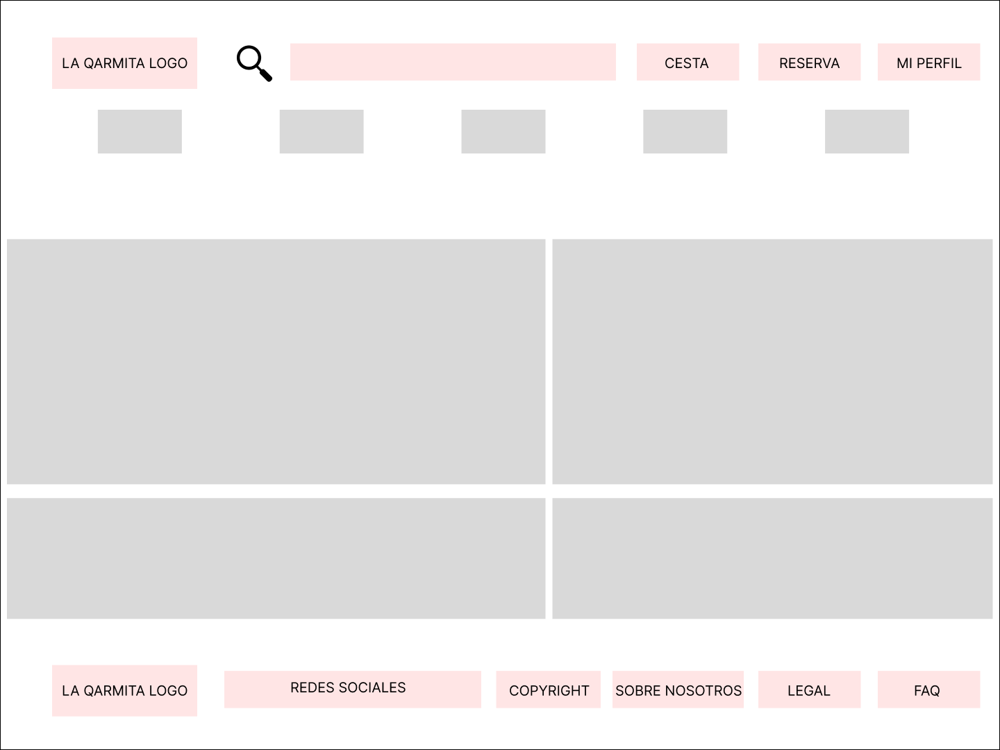

#### Home con Grid
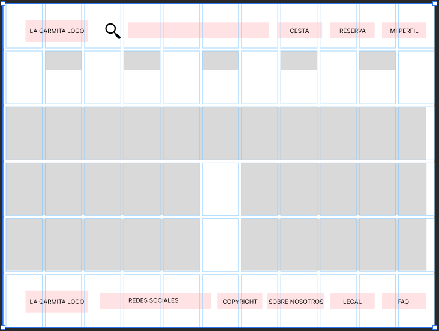

#### Agenda Cultural
La vista de la agenda muestra de manera estructurada los eventos de la semana o mes (talleres, exposiciones artísticas, presentaciones de libros). Se prioriza la legibilidad y la facilidad para inscribirse en las distintas actividades propuestas.
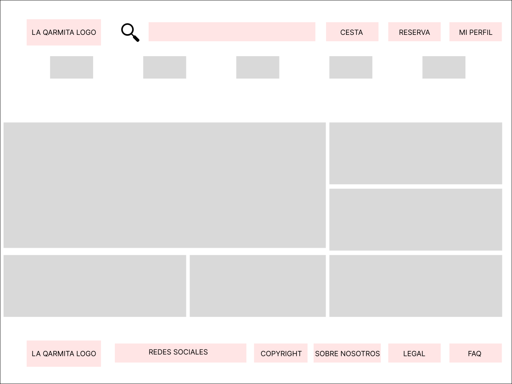

#### Agenda Cultural con Grid
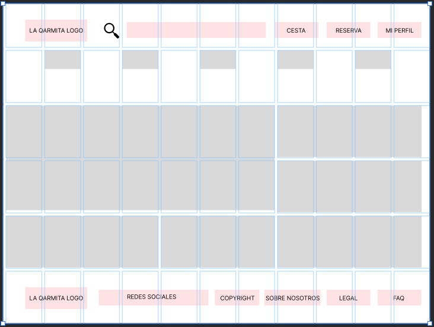

#### Mi Perfil
Este apartado permite al usuario administrar sus datos personales, comprobar sus puntos y beneficios del "Club Qarmita", y revisar el estado de sus reservas o su historial de compras y asistencia a eventos.
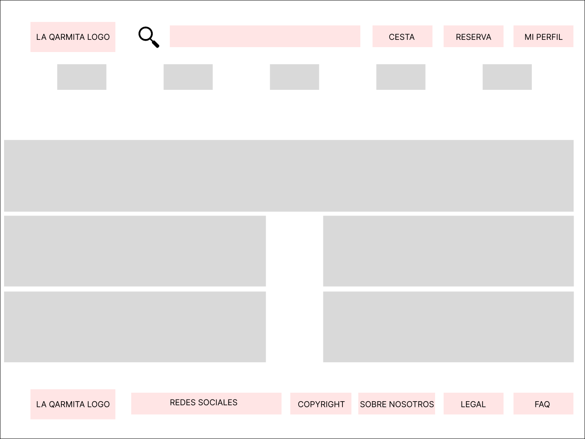

#### Mi Perfil con Grid
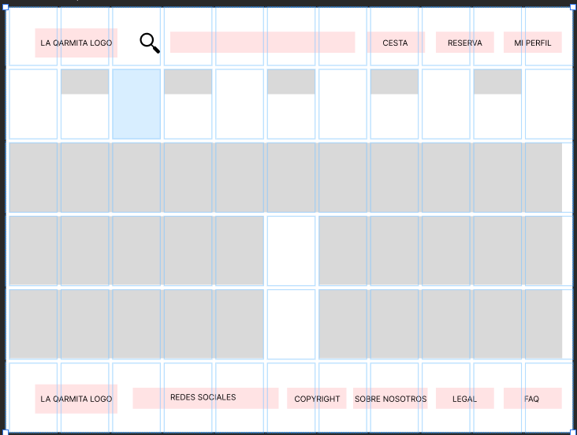

 

## Paso 3. Mi UX-Case Study (diseño)

### 3.a Moodboard

-----

El objetivo principal de esta fase es definir el lenguaje visual y el tono comunicativo que respaldarán la remodelación estética y funcional de la web original de La Qarmita. A través de este Moodboard, buscamos establecer una línea gráfica cálida y cercana que refleje la unión perfecta entre el café de especialidad y la escena cultural local.

*   **Logotipo:** Se ha diseñado un imagotipo minimalista que fusiona sutilmente una taza humeante de café con un libro abierto, usando una tipografía Serif clásica (*Playfair Display*) para transmitir autenticidad y madurez cultural.
*   **Herramientas utilizadas:** Se ha empleado Figma para la composición gráfica del Moodboard. Para la creación conceptual del logotipo y las referencias fotográficas nos hemos apoyado en Inteligencia Artificial (Gemini).

### 3.b Landing Page
 
----

A continuación se muestra el landing page del proyecto:

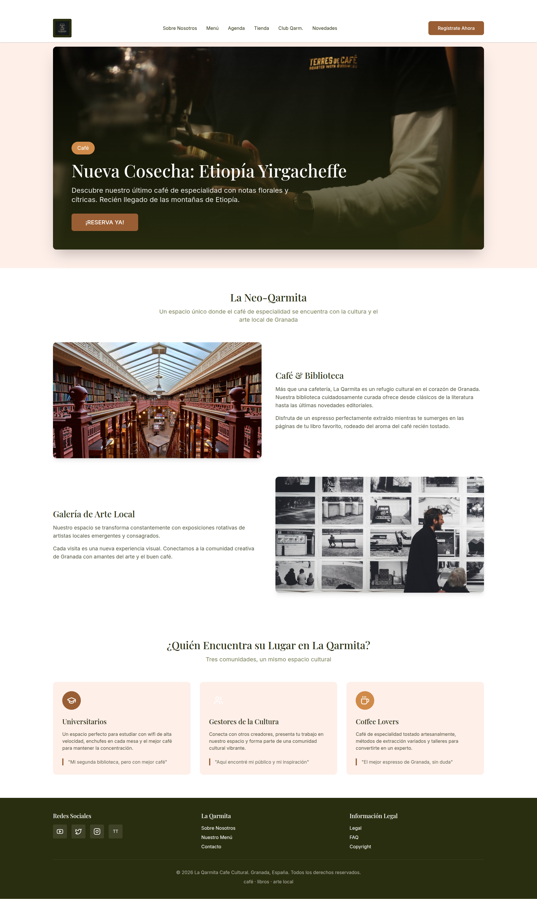

### 3.c Guidelines
 
----

>>> Estudio de Guidelines y explicación de los Patrones IU a usar 
>>> Es decir, tras documentarse, muestre las deciones tomadas sobre Patrones IU a usar para la fase siguiente de prototipado. 

### 3.d Mockup
 
----

>>> Consiste en tener un Layout en acción. Un Mockup es un prototipo HTML que permite simular tareas con estilo de IU seleccionado. Muy útil para compartir con stakeholders

 

## Paso 4. Pruebas de Evaluación 

### 4.a Reclutamiento de usuarios 

-----

>>> Breve descripción del caso asignado (llamado Caso-B) con enlace al repositorio Github
>>> Tabla y asignación de personas ficticias (o reales) a las pruebas. Exprese las ideas de posibles situaciones conflictivas de esa persona en las propuestas evaluadas. Mínimo 4 usuarios: asigne 2 al Caso A y 2 al caso B.

| Usuarios | Sexo/Edad     | Ocupación   |  Exp.TIC    | Personalidad | Plataforma | Caso
| ------------- | -------- | ----------- | ----------- | -----------  | ---------- | ----
| User1's name  | H / 18   | Estudiante  | Media       | Introvertido | Web.       | A 
| User2's name  | H / 18   | Estudiante  | Media       | Timido       | Web        | A 
| User3's name  | M / 35   | Abogado     | Baja        | Emocional    | móvil      | B 
| User4's name  | H / 18   | Estudiante  | Media       | Racional     | Web        | B 

### 4.b Diseño de las pruebas 
 
-----

>>> Planifique qué pruebas se van a desarrollar. ¿En qué consisten? ¿Se hará uso del checklist de la P1?

### 4.c Cuestionario SUS
 
----

>>> Como uno de los test para la prueba A/B testing, usaremos el **Cuestionario SUS** que permite valorar la satisfacción de cada usuario con el diseño utilizado (casos A o B). Para calcular la valoración numérica y la etiqueta linguistica resultante usamos la [hoja de cálculo](https://github.com/mgea/DIU19/blob/master/Cuestionario%20SUS%20DIU.xlsx). Previamente conozca en qué consiste la escala SUS y cómo se interpretan sus resultados
http://usabilitygeek.com/how-to-use-the-system-usability-scale-sus-to-evaluate-the-usability-of-your-website/)
Para más información, consultar aquí sobre la [metodología SUS](https://cui.unige.ch/isi/icle-wiki/_media/ipm:test-suschapt.pdf)
>>> Adjuntar en la carpeta P4/ el excel resultante y describa aquí la valoración personal de los resultados 

### 4.d A/B Testing
 
-----

>>> Los resultados de un A/B testing con 3 pruebas y 2 casos o alternativas daría como resultado una tabla de 3 filas y 2 columnas, además de un resultado agregado global. Especifique con claridad el resultado: qué caso es más usable, A o B?

### 4.e Aplicación del método Eye Tracking 

----

>>> Indica cómo se diseña el experimento y se reclutan los usuarios. Explica la herramienta / uso de gazerecorder.com u otra similar. Aplíquese únicamente al caso B.

  
>>> Cambiar esta img por una de vuestro experimento. El recurso deberá estar subido a la carpeta P4/  

>>> gazerecorder en versión de pruebas puede estar limitada a 3 usuarios para generar mapa de calor (crédito > 0 para que funcione) 

### 4.f Usability Report de B
 
-----

>>> Añadir report de usabilidad para práctica B (la de los compañeros) aportando resultados y valoración de cada debilidad de usabilidad. 
>>> Enlazar aqui con el archivo subido a P4/ que indica qué equipo evalua a qué otro equipo.

>>> Complementad el Case Study en su Paso 4 con una Valoración personal del equipo sobre esta tarea

 

## Paso 5. Exportación y Documentación 

### 5.a Exportación a HTML/React
 
----

>>> Breve descripción de esta tarea. Las evidencias de este paso quedan subidas a P5/

### 5.b Documentación con Storybook

----

>>> Breve descripción de esta tarea. Las evidencias de este paso quedan subidas a P5/

 

## Conclusiones finales & Valoración de las prácticas

>>> Opinión FINAL del proceso de desarrollo de diseño siguiendo metodología UX y valoración (positiva /negativa) de los resultados obtenidos. ¿Qué se puede mejorar? Recuerda que este tipo de texto se debe eliminar del template que se os proporciona 

