# DIU26

Prácticas Diseño Interfaces de Usuario (Tema: .... )

* [Guiones de prácticas](GuionesPracticas/)
* [Guía para crea tu Case Study](Guia_CaseStudy.md)
* Sala de la Fama [DIU Hall of fame](https://github.com/mgea/DIU/tree/master/hall_of_fame) donde se pueden encontrar Case Study destacados de otros años.
* [Recursos/plantillas en figma](https://www.figma.com/design/BN2IR0q2clOSplfMmalh9K/DIU_Toolkit_Framework--2026-)

Actualizado: 14/01/2026

## Paso 0 My UX-Case Study

Grupo: DIU2.Errores404.  Curso: 2025/26

Nombre del Proyecto: La Qarmita - Cultura y Café - El cambio de paradigma

Descripción:
Plataforma de gestión y promoción de experiencias culturales vinculadas al consumo de café de especialidad, basada en el caso de estudio de La Qarmita. Se busca un cambio de paradigma no solo en la web sino en la forma de fidelizar a los nuevos clientes.

**Web del Mockup:** [https://crane-boho-90485797.figma.site](https://crane-boho-90485797.figma.site)

🌐 **Web en producción:** [https://errores404-laqarmita.surge.sh](https://errores404-laqarmita.surge.sh)

Logotipo:
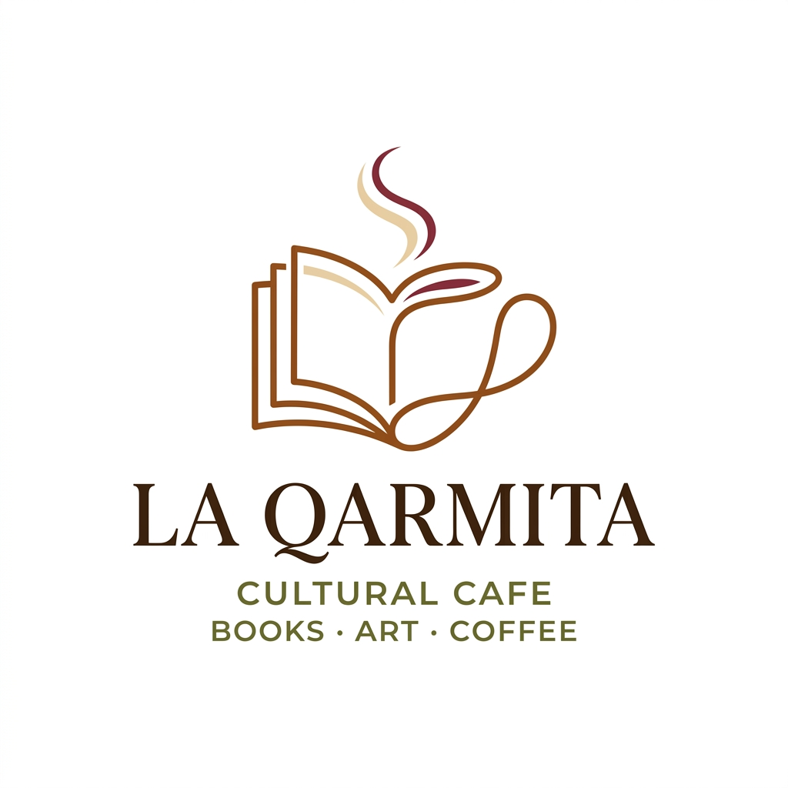

Miembros y nombre del equipo:

* 👤  Julian Carrion Tovar     :octocat: jxliian
* 👤  Miguel Angel Luque Gomez     :octocat: mangel

---

<br>

# Proceso de Diseño

<br>

## Paso 1. UX User & Desk Research & Analisis

### 1.a User Reseach Plan

**Briefing:**
La Qarmita es un espacio cultural híbrido en el corazón de Granada que fusiona los conceptos de cafetería de especialidad, librería y galería de arte. Su propuesta de valor se centra en ofrecer una experiencia "slow cafe", donde el cliente no solo consume café de autor y repostería artesanal, sino que se sumerge en un ambiente literario y artístico, con eventos como presentaciones de libros y exposiciones locales. Su público objetivo abarca desde estudiantes universitarios que buscan un lugar tranquilo para trabajar, hasta amantes de la cultura y el arte que valoran los espacios independientes y comunitarios.

A pesar de su fuerte identidad física y comunitaria, su presencia digital presenta retos significativos. La coexistencia de un blog antiguo (Blogspot) con una web más moderna pero limitada refleja una fragmentación en la experiencia del usuario online. No disponen de sistemas integrados de reserva, venta de libros e-commerce o una agenda de eventos interactiva clara. Esto penaliza la usabilidad y la conversión de usuarios que buscan interactuar con el espacio antes de visitarlo físicamente. Nuestra estrategia se centrará en analizar cómo unificar esta experiencia y potenciar la visibilidad de su oferta cultural única.

## User Research Plan (template)

## Descripción

Este **User Research Plan** define la estrategia para evaluar la experiencia de usuario de **La Qarmita**, un espacio que combina café, libros y arte en Granada. El objetivo es identificar las fricciones en su ecosistema digital actual y sentar las bases para una propuesta de diseño unificada.

## Antecedentes y Objetivos (The "Why")

- **Contexto:** La Qarmita cuenta con una fuerte identidad física pero una presencia digital fragmentada (Blogspot vs Web principal). Evaluamos el estado actual para entender cómo los usuarios interactúan con su oferta cultural antes de visitar el local.
- **Objetivos de investigación:** Con este informe se busca identificar si los usuarios encuentran fácilmente la agenda de eventos culturales así como evaluar la facilidad para localizar información crítica (horarios, ubicación, menú) en el sitio de Blogspot y finalmente comprender la percepción del usuario sobre la dualidad "café-librería" a través de la interfaz.
- **Experiencia del equipo:** Basados en nuestra experiencia, creemos que la oferta de este tipo de servicios distintivos como complemento a servicios tradicionales como las cafeterías aportan un valor añadido que provoca una mayor atracción del cliente respecto a la competencia.

#### 2. Metodología (The "How")

- **Cualitativa:** Las entrevistas a clientes y la observación etnográfica son algunas de las técnicas más fiables y directas para obtener información de primera mano.
- **Cuantitativa:** Número de clientes nuevos semanal, medición de visitas a la web, estancia media en la web y en el local, gasto promedio de los clientes, número de reseñas positivas/neagativas en la web.
- **KPI Indicators:** Número de clics (¿Cuánto tarda el usuario en encontrar lo que busca?), tasa de rebote (nos dice si el usuario abandonó por no saber hacer de inmediato lo que tenía que hacer) ¿Logra el usuario lo que busca?

#### 3. Perfil de los Participantes (The "Who")

-Estudiantes (mayormente universitarios) que buscan relajarse en un sitio tranquilo para poder concentrarse o desconectar del trabajo.

-Personas que ven en la pausa para el café su pequeño espacio de desconexión diario.

-Apasionados de la literatura, la cultura y otras formas de arte que buscan lugares en los que rodearse de personas con gusto similar para compartir sus experiencias.

#### 4. Guion y Tareas (The "What")

Se pretende que los usuarios sean capaces de realizar las siguientes tareas:

- Buscar el horario de apertura del local para los fines de semana.
- Encontrar el nombre de la exposición actual en la Galería Qarmitera.
- Localizar la lista de precios de los desayunos o alguna especialidad de café concreta.
- Dejar una reseña en la página reflejando su experiencia con el servicio.

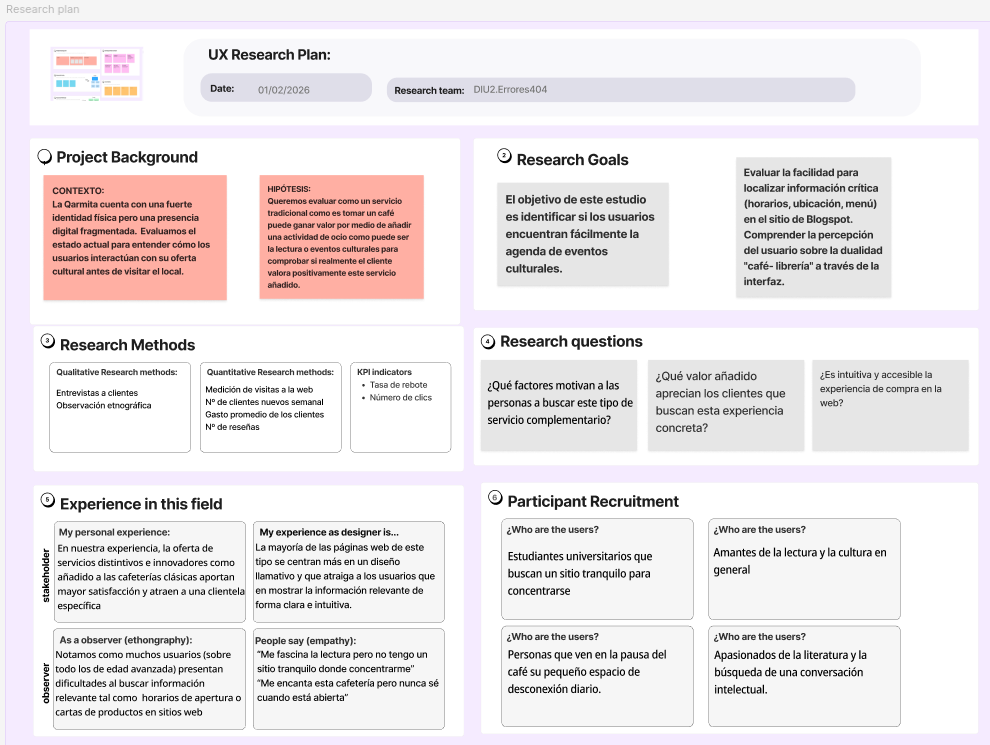

### 1.b Competitive Analysis

Para el análisis competitivo, hemos comparado **La Qarmita** con otras dos propuestas destacadas de café de especialidad en Granada: **Despiertoo** (Tostadores locales) y **Noat Coffee** (Referente en Plaza de los Girones).

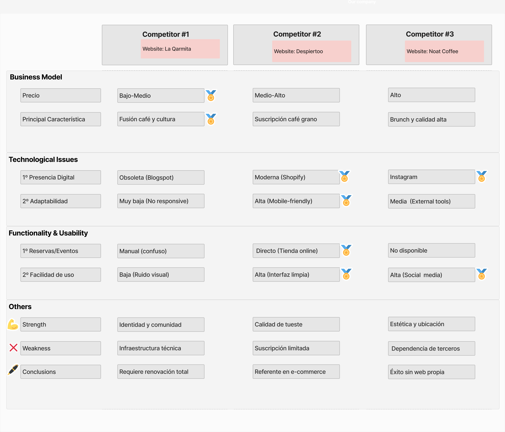

<!-- 
| Categoría | Características | La Qarmita | Despiertoo | Noat Coffee |
| :--- | :--- | :---: | :---: | :---: |
| **Business Model** | Precio / Suscripción | Bajo-Medio / Eventos | Medio-Alto / Mayorista | Alto / Especialidad |
| | | Fusión café y cultura | Suscripción café grano | Brunch y calidad alta |
| **Technological Issues** | 1º Presencia Digital | Obsoleta (Blogspot) | Moderna / Shopify | Instagram-First |
| | 2º Adaptabilidad | Muy baja (No responsive) | Alta (Mobile-friendly) | Media (External tools) |
| **Functionality & Usability** | 1º Reservas/Eventos | Manual / Muy confuso | Directo (Tienda online) | No disponible |
| | 2º Facilidad de uso | Baja (Ruido visual) | Alta (Interfaz limpia) | Alta (Social media) |
| **Others** | **Strength** | Identidad y comunidad | Calidad de tueste | Estética y ubicación |
| | **Weakness** | Infraestructura técnica | Suscripción limitada | Dependencia de terceros |
| | **Conclusions** | Requiere renovación total | Referente en e-commerce | Éxito sin web propia | -->

Hemos seleccionado **La Qarmita** como caso principal porque, a pesar de tener la oferta cultural más rica, su plataforma digital es la que presenta mayores retos. Despiertoo representa el estándar moderno de tienda online de café en la ciudad, mientras que Noat Coffee demuestra que un buen producto y ubicación pueden sostenerse con una presencia digital minimalista pero efectiva, remarcando lo que La Qarmita pierde por su falta de usabilidad técnica.

**Posicionamiento e Identidad**
La Qarmita compite con una propuesta de valor única basada en la "Fusión café y cultura" y un modelo de precio "Bajo-Medio". Su mayor fortaleza radica en la consolidación de su "Identidad y comunidad". Sus competidores, en cambio, apuntan a un ticket superior (Medio-Alto y Alto), enfocándose en la "Suscripción café grano" o en el "Brunch y calidad alta".

**Presencia y Distribución Digital**
El mayor contraste se encuentra en los canales de distribución de contenido. La gran debilidad de La Qarmita es su infraestructura técnica, al contar con una presencia digital obsoleta (basada en un blogspot) y una adaptabilidad muy baja. En cambio, Despiertoo domina este aspecto con una plataforma Moderna (Shopify) y una alta adaptabilidad móvil. Por su parte, Noat Coffee demuestra que es posible tener éxito externalizando su contenido al centrar su presencia en redes sociales de gran alcance como Instagram.

**Funcionalidad y Usabilidad (UX)**
La gestión del contenido interactivo en La Qarmita es deficiente; su sistema de reservas es manual y confuso, además presenta una escasa facilidad de uso debido al ruido visual(gran cantidad de imágenes, escaso orden). Despiertoo marca el estándar del sector con gestión directa (posee tienda online) y una interfaz limpia. Noat Coffee, aunque no dispone de reservas, mantiene una alta usabilidad a través del uso de redes sociales.

**Conclusiones y Oportunidades**
La principal brecha competitiva de La Qarmita es tecnológica. Como conclusión, el negocio requiere renovación total en este aspecto ya que el servicio del establecimiento es uno de sus puntos más fuertes. Para potenciar su fuerte comunidad, la estrategia debe enfocarse en migrar hacia una plataforma web propia y "responsive" que elimine la fricción en las interacciones y ofrezca una experiencia de usuario limpia, a la altura del estándar marcado por Despiertoo y de las expectativas de las nuevas generaciones.

### 1.c Personas

Hemos diseñado dos perfiles de usuario que representan los segmentos clave de La Qarmita: el estudiante universitario que busca un espacio de estudio/ocio y la profesional del sector cultural interesada en el espacio artístico.

#### Persona 1: Natalio Genil

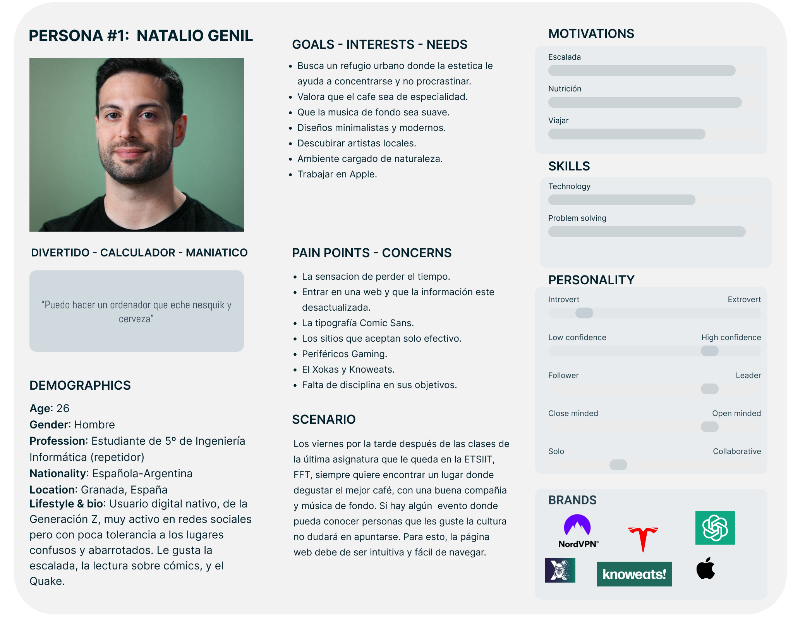

Natalio es un estudiante de Ingeniería Informática de 26 años que busca un "refugio" urbano tranquilo y con buena estética para concentrarse en sus estudios, valorando el café de calidad y la ausencia de ruidos molestos.

#### Persona 2: Elena Valero

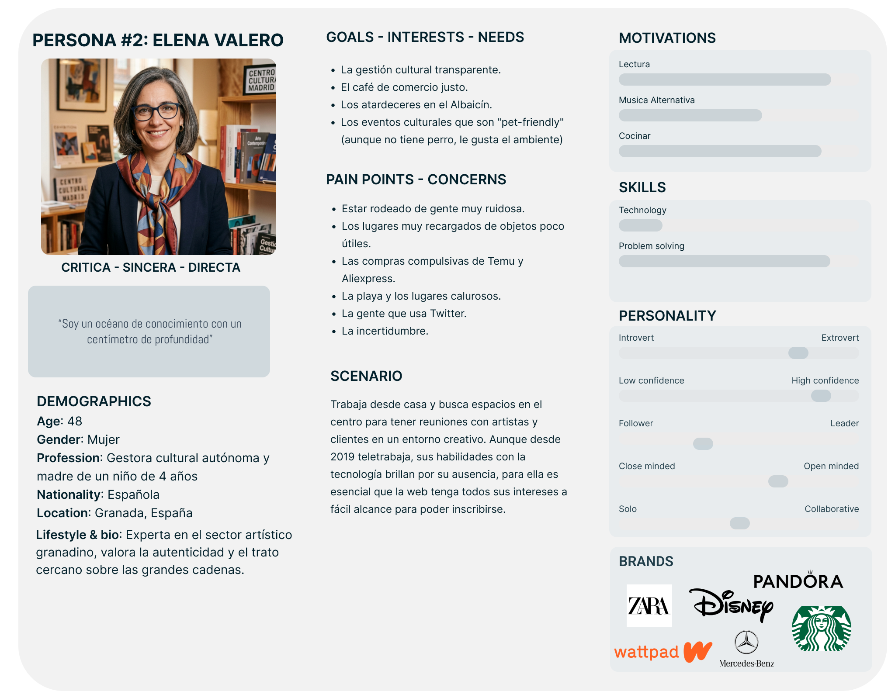

Elena es una gestora cultural de 48 años que busca espacios auténticos para reuniones y colaboraciones artísticas, interesándose por la accesibilidad del local y la claridad en la agenda de eventos culturales.

### 1.d User Journey Map

Hemos seleccionado dos situaciones habituales que reflejan los problemas de usabilidad detectados en la presencia digital de La Qarmita.

#### Business Case 1: Natalio buscando un refugio para el estudio

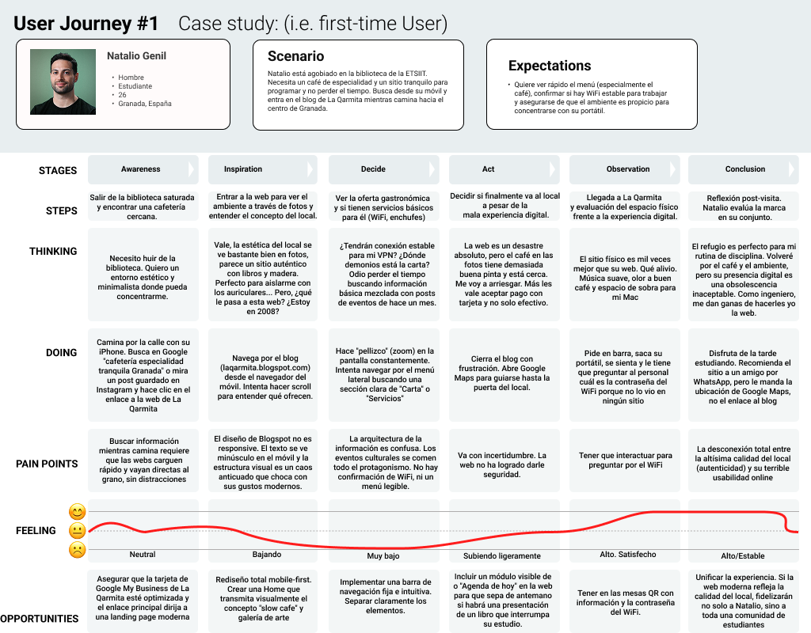

Este mapa describe la experiencia de Natalio al intentar encontrar información sobre el local desde su móvil, destacando las frustraciones causadas por una web no adaptada a dispositivos móviles.

#### Business Case 2: Elena organizando una reunión cultural

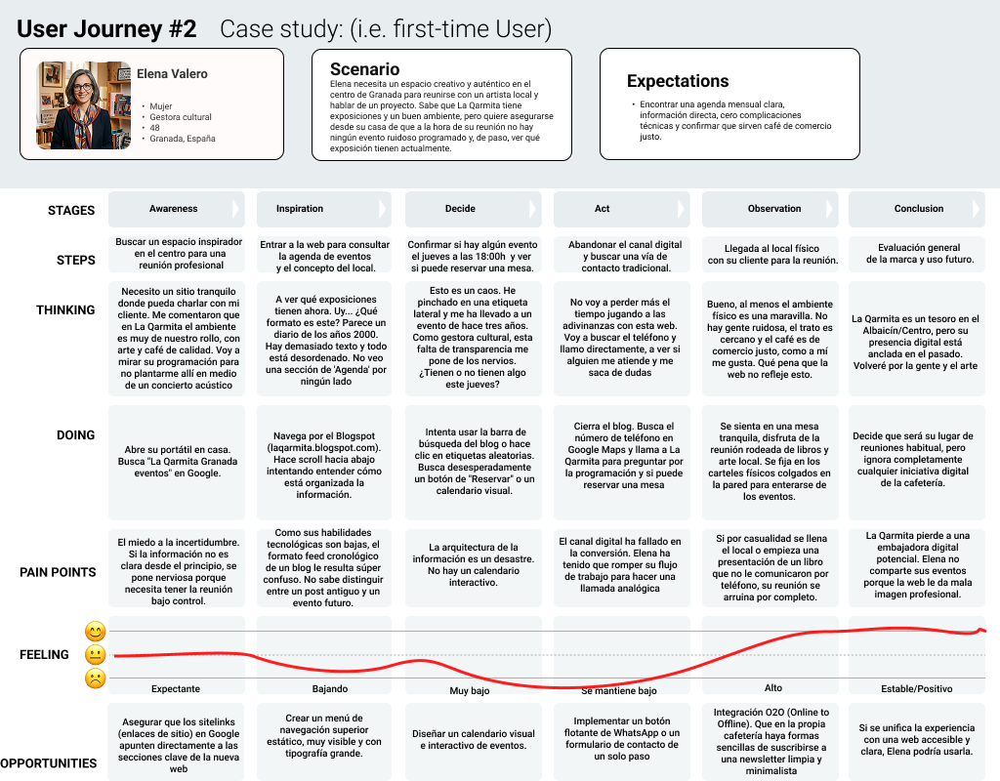

Elena experimenta dificultades al intentar coordinar una reunión y proponer una exposición, enfrentándose a una arquitectura de información confusa que mezcla contenido irrelevante con la agenda cultural.

### 1.e Usability Review

- **Enlace al documento:** [Usability-review-PDF](./P1/Usability-review-template_hecho.pdf)
- **URL analizada:** https://laqarmita.blogspot.com/
- **Valoración numérica:** 46/100 (Rango: Pobre)
- **Comentario sobre la revisión:**
  La principal debilidad de La Qarmita es su obsolescencia técnica. Al basarse en una plantilla de Blogspot, no cumple con los estándares modernos. A continuación se detallan los hallazgos principales:

#### Puntos Fuertes (Fortalezas)

* **Propuesta de Valor Clara:** Identificación inmediata del concepto híbrido (Café + Libros + Cultura) al acceder al sitio.
* **Contenido Visual Auténtico:** El uso de material gráfico propio del local transmite fielmente su atmósfera y genera confianza.
* **Transparencia y Filosofía:** La sección de historia y valores ayuda a conectar emocionalmente con el público objetivo.

#### Contras (Debilidades / Puntos de Dolor)

* **Nula Adaptabilidad (Responsive):** Experiencia de usuario fracturada en móviles; elementos superpuestos y navegación muy difícil.
* **Arquitectura de Información Lineal:** La estructura de blog entierra información crítica (menú, precios, contacto) bajo posts cronológicos.
* **Inaccesibilidad de la Agenda Cultural:** Falta de un calendario interactivo; los eventos son difíciles de localizar y consultar por fechas futuras.
* **Baja Conversión:** Ausencia de llamadas a la acción directas para reservas, compra de libros o suscripción a eventos.
* **Obsolescencia Técnica:** Limitación en la velocidad de carga e interactividad debido a la infraestructura técnica anticuada.

### 1.f Briefing

La Qarmita ofrece una experiencia única y valiosa en el mundo real, fusionando café de especialidad, libros y arte. Sin embargo, su escaparate digital principal (un Blogspot obsoleto) no refleja esta calidad y supone una barrera de entrada. Para el usuario moderno, la web resulta confusa, poco inmersiva, difícil de navegar en dispositivos móviles y no visibiliza adecuadamente la oferta dinámica del local, como su agenda de eventos, exposiciones y talleres. La web presenta una arquitectura de información que entierra realmente la información crítica de la web, además se ve limitada por la velocidad de carga e interactividad de la infraestructura técnica anticuada.

Existe una discrepancia enorme entre el "producto" físico (excelente) y el "producto" digital (deficiente). Rediseñando integralmente la plataforma online, tenemos la oportunidad no solo de arreglar la usabilidad básica, sino de crear una herramienta que potencie el ecosistema de La Qarmita. Al construir un entorno web moderno, dinámico y "Mobile-First", podemos transformar a visitantes curiosos en clientes habituales y promover la participación activa en su oferta cultural.

<br>

## Paso 2. UX Design

### 2.a Reframing / IDEACION: Empathy Map

---

A partir de la experiencia adquirida en el análisis de competidores y el journey de nuestros usuarios, hemos sintetizado los hallazgos empleando un **Mapa de Empatía** general que engloba a nuestras Personas principales. Esta herramienta nos ayuda a entender mejor qué dicen, piensan, hacen y sienten, permitiendo identificar puntos clave (*pains & gains*) para nuestra nueva propuesta de valor. La propuesta se enfoca en resolver las carencias tecnológicas de la competencia directa solucionando el ruido visual y mejorando los canales de información.

#### Mapa de Empatía General


**Problema e Hipótesis:**
La principal carencia actual es la infraestructura técnica y la fragmentación digital de la experiencia. Nuestra hipótesis se fundamenta en que una unificación del ecosistema digital de La Qarmita, que ofrezca una navegación intuitiva y una agenda centralizada (*Mobile-First*), eliminará la fricción en la interacción del usuario e impulsará el alcance de la comunidad artística y cultural local. Además de un modelo de subscripción para fidelizar a los usuarios.

### 2.b ScopeCanvas

En este ScopeCanvas detallamos la propuesta de valor para **La Qarmita**, centrada en unificar su experiencia física y digital, además del establecimiento de otras medidas como el "sistema de recompensas". Definimos los propósitos y métricas de nuestro proyecto, alineando las necesidades de los usuarios (como estudiantes y gestores culturales) con los objetivos de negocio.

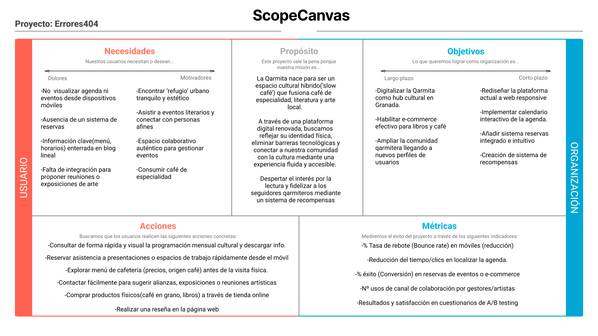

### 2.b User Flow (task) analysis

**User Task Matrix**

En nuestra matriz de tareas de usuario, hemos recopilado las funciones principales que la plataforma debe ofrecer y hemos evaluado la relevancia de cada una para nuestros distintos públicos. Para ello, hemos definido tres grupos clave basándonos en las Personas y los roles del sistema, asignando prioridades de Alta (H), Media (M) y Baja (L), o usando un guión (-) si la acción no aplica.

| Acción / Función                          | Cliente Habitual (Natalio) | Nuevo Cliente (Elena) | Administrador |
| :------------------------------------------ | :------------------------: | :-------------------: | :-----------: |
| Iniciar sesión / Registrarse               |             H             |           H           |       H       |
| Consultar horario, ubicación y afluencia   |             M             |           H           |       L       |
| Ver menú y carta de cafés de especialidad |             H             |           M           |       L       |
| Ver agenda de eventos y exposiciones        |             H             |           H           |       L       |
| Reservar una mesa / espacio de estudio      |             H             |           H           |       -       |
| Suscribirse al plan de fidelización        |             H             |           L           |       -       |
| Comprar en la tienda online (Café/Libros)  |             M             |           L           |       -       |
| Proponer un evento o exposición artística |             -             |           H           |       -       |
| Gestionar y Aprobar agenda cultural         |             -             |           -           |       H       |
| Publicar nuevo producto en la tienda/menú  |             -             |           -           |       H       |
| Dejar una reseña o comentario              |             M             |           M           |       -       |
| Editar perfil y preferencias de alertas     |             H             |           H           |       H       |
| Contactar con soporte / Resolver dudas      |             L             |           M           |       H       |

<br>

**User / Task Flow**

A continuación se muestran los diagramas de flujo para las tareas principales seleccionadas, detallando el recorrido paso a paso que realiza el usuario para completarlas.

#### Taskflow 1

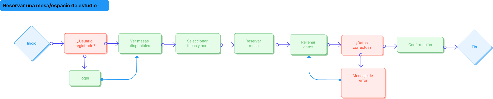

#### Taskflow 2

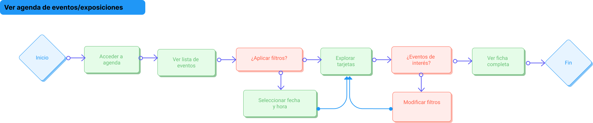

### 2.c IA: Sitemap + Labelling

<!-- >>> Identificar términos para diálogo con usuario (evita el spanglish) y la arquitectura de la información. Es muy apropiado un diagrama tipo sitemap y una tabla que se ampliaría para llevar asociado la columna iconos (tanto para la web como para una app).  -->

* **Sitemap**

<!-- Este sitemap es orientativo, mangel debera de cambiarlo por el que haga el bien -->

<!-- Te recomiendo que veas los de otros años para que veas como hacerlo 
Lo ideal seria que fuera un arbol con profundidad +2 pq ahora solo tiene profundidad 2 -->

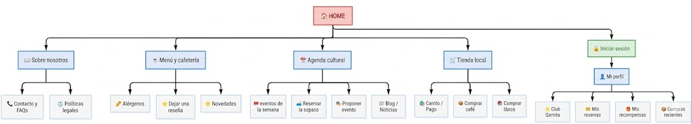

* **Labelling**

| Término                   | Significado                                                                   | Icono |
| :------------------------- | :---------------------------------------------------------------------------- | :---: |
| Inicio                     | Página principal que da acceso a todas las secciones de La Qarmita           |  🏠  |
| Sobre Nosotros             | Historia, ubicación, horarios y concepto del local (Café & Cultura)         |  📖  |
| Menú / Carta              | Catálogo detallado de cafés de especialidad, tés y repostería artesanal   |  ☕  |
| Alérgenos                 | Información de ingredientes, trazas e intolerancias del menú de comida      |  🥜  |
| Agenda Cultural            | Calendario interactivo con eventos, exposiciones y talleres próximos         |  📅  |
| Detalle del Evento         | Página de un evento específico con información de autores o entradas       | 🎟️ |
| Novedades / Blog           | Noticias de La Qarmita, artículos sobre café y crónicas de exposiciones    |  📰  |
| Reservar Mesa              | Sección para solicitar reserva de una mesa o un espacio de estudio/reunión  | 🛋️ |
| Tienda Local               | Espacio para comprar café en grano, libros y merchandising                   |  🛒  |
| Club Qarmita               | Información y suscripción al plan de fidelización/recompensas del local    |  🌟  |
| Proponer Evento            | Formulario para que artistas y gestores culturales propongan actividades      |  🎭  |
| Preguntas Frecuentes       | Resolución de dudas sobre espacios, métodos de pago y reservas (FAQ)        |  ❓  |
| Contacto                   | Canales de comunicación directa, redes sociales y mapa de ubicación         |  📞  |
| Políticas Legales         | Términos de uso, política de privacidad y condiciones de venta              | ⚖️ |
| Iniciar Sesión / Registro | Acceso privado a la plataforma para clientes y organizadores                  |  👤  |
| Recuperar Contraseña      | Proceso automatizado para restablecer el acceso a la cuenta                   |  🔑  |
| Mi Perfil                  | Gestión de preferencias de alertas, datos personales, y configuración       | ⚙️ |
| Mis Favoritos              | Lista de deseos del usuario para guardar libros, eventos o cafés de interés | ❤️ |
| Mis Reservas               | Apartado interno del perfil para consultar las reservas de mesas o eventos    |  🎫  |
| Historial de Compras       | Registro de pedidos previos en la tienda online y seguimiento de envíos      |  📦  |
| Carrito                    | Resumen de los artículos/libros seleccionados listos para proceder al pago   | 🛍️ |
| Reseñas                   | Espacio interactivo para que los usuarios valoren su experiencia y opinen     |  ⭐  |
| Panel de Control           | (Admin) Gestión interna completa de la agenda cultural, tienda y usuarios    |  🔒  |
| Cerrar Sesión             | Opción para finalizar de forma segura la sesión iniciada en el sistema      |  🚪  |

### 2.d Wireframes

En esta sección detallamos el diseño del layout en su versión desarrollado con la herramienta **Figma**, enfocándonos en la organización y simulación de la interfaz. Estos wireframes de baja fidelidad (Lo-Fi) nos ayudan a establecer la jerarquía visual de la información y la disposición de las funcionalidades básicas.

Puedes consultar el diseño completo y los primeros acercamientos en el siguiente enlace:
🔗 **[Ver bocetos de los wireframes (PDF)](./P2/Entrega/Wireframe_boceto.pdf)**

A continuación, exponemos las vistas principales del rediseño:

#### Home (Página Principal)

La pantalla de inicio busca distribuir a los usuarios hacia las áreas clave de La Qarmita: próximos eventos, reservas y productos destacados de su tienda o carta.
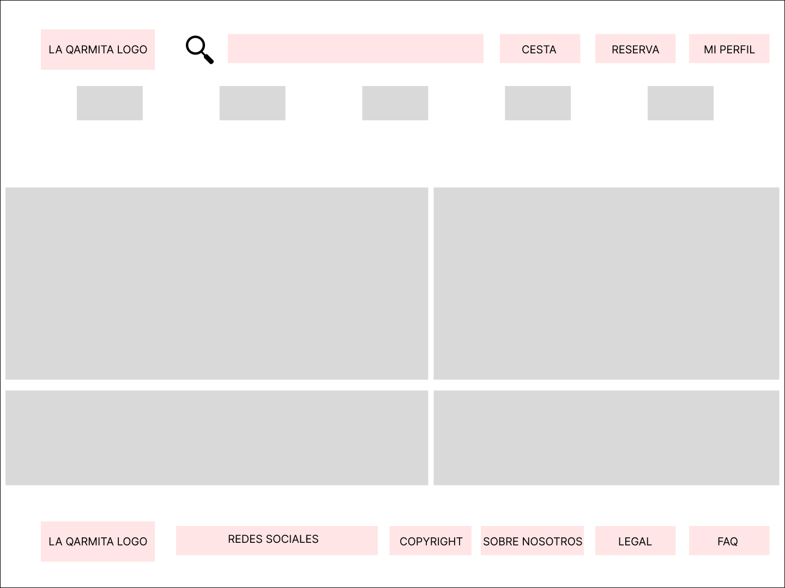

#### Home con Grid

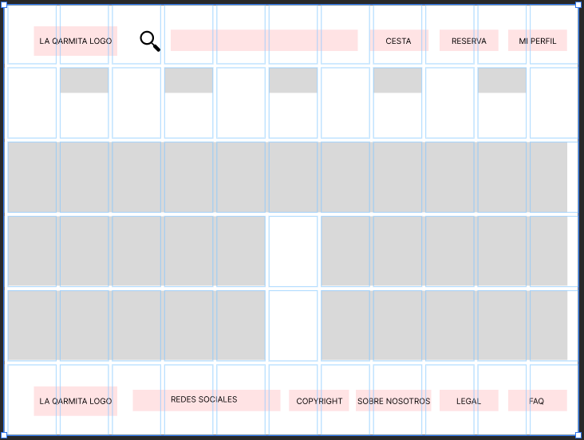

#### Agenda Cultural

La vista de la agenda muestra de manera estructurada los eventos de la semana o mes (talleres, exposiciones artísticas, presentaciones de libros). Se prioriza la legibilidad y la facilidad para inscribirse en las distintas actividades propuestas.
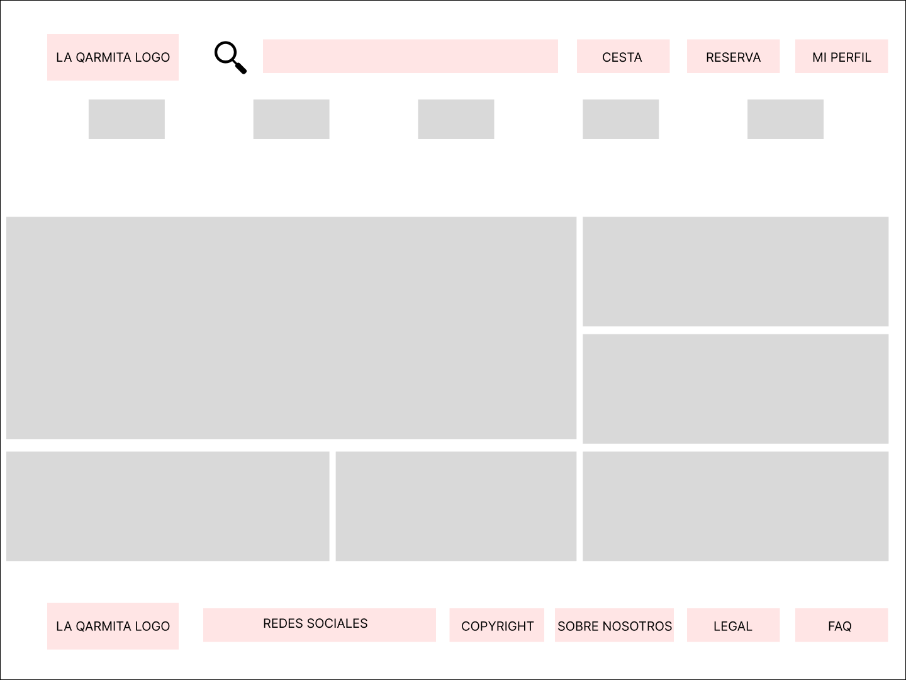

#### Agenda Cultural con Grid

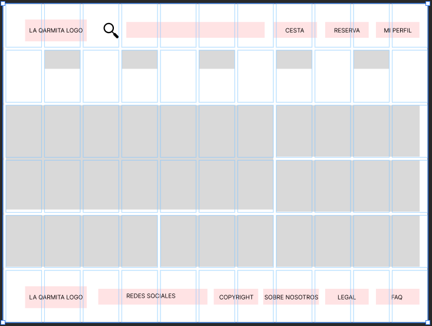

#### Mi Perfil

Este apartado permite al usuario administrar sus datos personales, comprobar sus puntos y beneficios del "Club Qarmita", y revisar el estado de sus reservas o su historial de compras y asistencia a eventos.
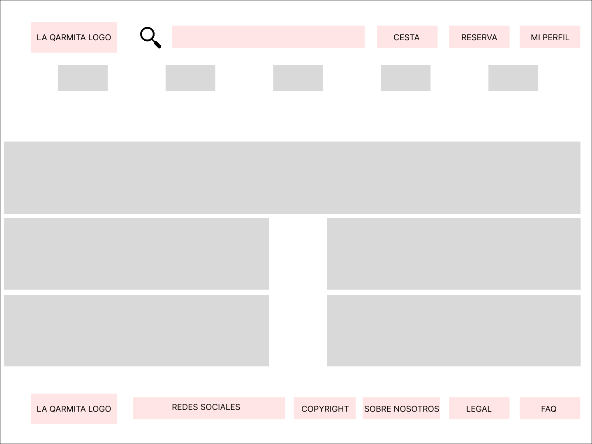

#### Mi Perfil con Grid

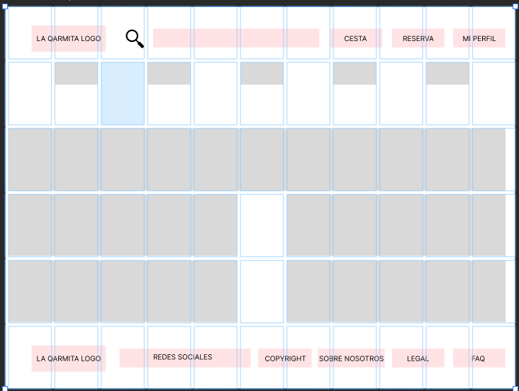

<br>

## Paso 3. Mi UX-Case Study (diseño)

### 3.a Moodboard

El objetivo principal de esta fase es definir el lenguaje visual y el tono comunicativo que respaldarán la remodelación estética y funcional de la web original de La Qarmita. A través de este Moodboard, buscamos establecer una línea gráfica cálida y cercana que refleje la unión perfecta entre el café de especialidad y la escena cultural local.


* **Logotipo:** Se ha diseñado un imagotipo minimalista que fusiona sutilmente una taza humeante de café con un libro abierto, usando una tipografía Serif clásica (*Playfair Display*) para transmitir autenticidad y madurez cultural.
* **Herramientas utilizadas:** Se ha empleado Figma para la composición gráfica del Moodboard. Para la creación conceptual del logotipo y las referencias fotográficas nos hemos apoyado en Inteligencia Artificial (Gemini).

### 3.b Landing Page

De cara a la elaboración del Landing Page se han introducido modificaciones respecto al diseño inicial del Wireframe. Posteriormente a la reunión con el profesor, se nos remarcó los siguientes puntos a mejorar de cara al Design System:

* **Hero Section:** Establecer un hero section con una imagen de fondo y un título que invite a la acción. Por medio de un botón se redirigirá al usuario a la página de agenda.*

A continuación se muestra el landing page del proyecto:


#### Proceso de Generación de Prompts (Fibe Coding / IA)

Para la creación de esta Landing Page hemos utilizado la herramienta de IA **Figma Make**, siguiendo un proceso iterativo de refinamiento de prompts para alinear el diseño con nuestra propuesta de valor:

1. **Prompt Inicial (Estructura y Estilo):** Definimos una landing page Hi-Fi para "La Qarmita Cafe Cultural" detallando la paleta de colores (Crema, Espresso, Terracota), la tipografía (*Playfair Display* e *Inter*) y la arquitectura del wireframe (Novedades, Concepto Neo-Qarmita, Agenda y Público Objetivo).
2. **Refinamiento de Conversión:** Aumentamos el impacto visual del **Hero Section** (700px de altura) y priorizamos la acción principal mediante un botón llamativo de **"¡RESERVA YA!"** con efectos hover.
3. **Simplificación de UI:** Eliminamos elementos de fricción como la barra de búsqueda y secciones redundantes de eventos para centrar la atención en la navegación principal y el storytelling.
4. **CTA Unificado:** Sustituimos los botones múltiples del header por un único Call to Action prominente de **"Regístrate ahora"**, simplificando la toma de decisiones del usuario.

### 3.c Design System & Guidelines

Para garantizar la consistencia visual y la escalabilidad del proyecto, hemos desarrollado un **Design System ligero** siguiendo la metodología de **Atomic Design**.

#### Herramientas e IA utilizada:

Siguiendo las recomendaciones del guion de prácticas, hemos utilizado el plugin de Figma **Foundation Studio** para automatizar la generación de nuestros cimientos (*Foundations*). Esta herramienta nos ha permitido definir de forma paramétrica:

* **Design Tokens:** Variables de color, escalas tipográficas y sistemas de espaciado basados en una retícula de 8px.
* **Consistencia:** Generación automática de rampas cromáticas y escalas modulares para jerarquías claras.

#### Decisiones de Diseño (Guidelines):

* **Paleta de Colores:**
  * **Primario (`#2A221C` - Café Espresso):** Transmite la sobriedad, profundidad y elegancia del café de especialidad.
  * **Secundario (`#C66B4A` - Terracota Arcilla):** Un color de acento cálido que invita a la acción y recuerda a los elementos orgánicos y artesanales.
  * **Fondo (`#F7F4EF` - Crema de Leche):** Sustituye al blanco puro para dar una sensación de papel o libro antiguo, reforzando el concepto de librería y reduciendo la fatiga visual.
* **Tipografía:**
  * **Encabezados (*Playfair Display*):** Una Serif clásica con trazos elegantes que evoca la tradición editorial y cultural.
  * **Cuerpo de Texto (*Inter*):** Una Sans-Serif moderna y geométrica optimizada para la máxima legibilidad en dispositivos digitales.

#### Patrones UI aplicados

* **Onboarding / About**

  * Sección "Concepto Neo-Qarmita" integrada en la portada que sirve para introducir al usuario al propósito del local, explicando su propuesta como "slow cafe", librería y galería de arte.
* **Menú (NavBar)**

  * Navegación principal clara y accesible desde la cabecera para dirigir a las secciones clave (Agenda Cultural, Menú/Carta, Tienda Local, etc.).
* **Hero image**

  * Imagen destacada ocupando la primera vista (Hero Section) con un título inmersivo que capta la atención.
* **Botones (Call to Actions)**

  * Botón principal prominente en la zona superior (Hero/Header) para guiar la conversión directa ("¡RESERVA YA!" o "Regístrate ahora").
  * Botones secundarios o enlaces de acción integrados en las tarjetas para fomentar la interacción directa con el contenido.
* **Article List (Cards)**

  * Uso de tarjetas (cards) para estructurar visualmente la sección de "Novedades" y la previsualización de la "Agenda" en la propia página principal, mostrando un resumen de las actividades destacadas.
* **About**

  * Sección sobre nosotros detallando la historia, filosofía, ubicación y horarios de La Qarmita.
* **Público objetivo**

  * Tarjetas descriptivas del público objetivo, acompañadas de imágenes representativas que los identifican.
* **Redes Sociales**

  * Integración de iconos de redes sociales en la sección de footer.
* **Footer**

  * Sección inferior (pie de página) que sirve como ancla de navegación secundaria, organizando la información de contacto, redes sociales, ubicación y políticas legales de La Qarmita.


### 3.d Mockup (Layout Hi-Fi)

El Mockup consiste en el diseño de alta fidelidad que integra los componentes del Design System en un layout interactivo. Se ha priorizado una **jerarquía visual semántica** (header, contenido destacado, agenda y footer) y la simulación de tareas críticas como la consulta de la agenda y la reserva de espacios.

La estructura se ha organizado mediante **Auto Layout** en Figma para garantizar un comportamiento responsive y facilitar la futura exportación a código HTML/CSS.

**Puedes visualizar la web del mockup en el siguiente enlace:**
🔗 **[Ver Mockup Interactivo (Figma Site)](https://crane-boho-90485797.figma.site)**

#### Vistas Principales del Mockup

|                              Novedades                              |                              Registro                              |                             Reserva                             |
| :-----------------------------------------------------------------: | :----------------------------------------------------------------: | :--------------------------------------------------------------: |
|                              |                              |                              |
| Sección de noticias y novedades sobre el café y la cultura local. | Formulario de registro para el plan de fidelización Club Qarmita. | Interfaz para la reserva rápida de mesas y espacios de estudio. |

|                                  Tienda                                  |                        Menú y Horarios                        |                                 Agenda                                 |
| :----------------------------------------------------------------------: | :------------------------------------------------------------: | :---------------------------------------------------------------------: |
|                                          |                            |                                        |
| Catálogo de productos con café de especialidad y libros seleccionados. | Carta digital con horarios de apertura y oferta gastronómica. | Calendario interactivo con los próximos eventos y talleres culturales. |

### 3.e Briefing

El uso de **Figma Make** (IA generativa) y el plugin **Foundation Studio** ha sido determinante en esta práctica: ambas herramientas han reducido considerablemente el tiempo invertido en la fase de base visual (design tokens, rampas cromáticas, componentes atómicos), permitiendo centrar el esfuerzo en la coherencia del flujo de usuario y la toma de decisiones de UX.

La metodología **Atomic Design** ha demostrado ser la elección correcta para este proyecto: la reutilización de átomos y moléculas garantiza consistencia entre todas las vistas y facilita iteraciones rápidas sin romper el sistema. Como punto fuerte destaca la integración del Design System directamente con el prototipo interactivo, eliminando la brecha habitual entre diseño y desarrollo.

La principal limitación encontrada fue la generación automática de layouts complejos mediante IA (Figma Make), que requirió múltiples rondas de refinamiento de prompts para ajustar la jerarquía visual y los criterios de accesibilidad (contraste de color). En conjunto, el resultado supera cualitativamente la web original de La Qarmita y sienta una base sólida para la exportación a código en la siguiente fase.

<br>

## Paso 4. Pruebas de Evaluación

### 4.a Reclutamiento de usuarios

**Caso B asignado:** Mejora de Goiko — [Repositorio del equipo](https://github.com/ClaudioDevv/UX_CaseStudy)

El Caso B corresponde a la propuesta de rediseño web del restaurante de hamburguesas **Goiko**. Su objetivo principal es modernizar la presencia digital del local, mejorando la navegación, la búsqueda de restaurantes, el proceso de reserva online y la visibilidad del menú. A diferencia de nuestra propuesta (Caso A), el Caso B se centra en un contexto de restauración rápida de calidad, con un enfoque más comercial y transaccional.

Se ha realizado un estudio entre-sujetos con **10 participantes**: 5 para el Caso A (NeoQarmita) y 5 para el Caso B (Mejora de Goiko). Los datos completos están disponibles en:

| Usuarios        | Sexo/Edad | Ocupación    | Exp. TIC | Personalidad | Plataforma | Caso | Posibles situaciones conflictivas                                          |
| :-------------- | :-------- | :------------ | :------- | :----------- | :--------- | :--- | :------------------------------------------------------------------------- |
| P01 — Marcos   | H / 22    | Estudiante    | Alta     | Racional     | Portátil  | A    | Puede buscar atajos y saltarse pasos si el flujo no es directo.            |
| P02 — Laura    | M / 28    | Diseñadora   | Alta     | Crítica     | Portátil  | A    | Puede ser muy exigente con la coherencia visual y el design system.        |
| P03 — Carlos   | H / 45    | Usuario final | Media    | Pausado      | Sobremesa  | A    | Puede tardar en identificar iconos sin etiquetas de texto.                 |
| P04 — Sofía   | M / 19    | Estudiante    | Media    | Impulsiva    | Portátil  | A    | Puede frustrarse si hay demasiados pasos para completar una reserva.       |
| P05 — Fernando | H / 60    | Usuario final | Baja     | Metódico    | Sobremesa  | A    | Puede no entender el sistema de fidelización sin explicación explícita. |
| P06 — Elena    | M / 24    | Estudiante    | Alta     | Comparativa  | Portátil  | B    | Puede comparar inconscientemente con otras webs de restaurantes similares. |
| P07 — David    | H / 31    | Desarrollador | Alta     | Analítico   | Portátil  | B    | Puede frustrarse si detecta problemas técnicos o de rendimiento.          |
| P08 — Pilar    | M / 52    | Usuario final | Baja     | Cautelosa    | Tablet     | B    | Puede abandonar el flujo de reserva si hay demasiados pasos.               |
| P09 — Roberto  | H / 35    | Usuario final | Media    | Práctico    | Sobremesa  | B    | Puede tener dificultades si la búsqueda de restaurante no es intuitiva.   |
| P10 — Nadia    | M / 21    | Estudiante    | Media    | Visual       | Móvil     | B    | Puede perder interés si la web no está optimizada para móvil.           |

### 4.b Diseño de las pruebas

Las pruebas se han desarrollado de forma presencial utilizando **GazeMapping** (Eye Tracking) y **Tally.so** (cuestionario SUS), basándonos en las acciones clave definidas en ambas propuestas. En cada caso se han analizado dos pantallas representativas del diseño.

#### 1. Prueba de tareas (interacción real)

Se proponen tareas concretas a cada usuario sobre el diseño que le corresponde. Las sesiones duran entre 5 y 10 minutos, supervisadas, y se anota si el usuario necesita ayuda para completarlas.

#### 2. Eye Tracking (GazeMapping)

Prueba de exploración libre seguida de tareas dirigidas. Se generan mapas de calor (heatmaps) para analizar la jerarquía visual, la atención en zonas de interés (POI) y la efectividad de los elementos de conversión (CTAs, menús, botones).

#### 3. Cuestionario SUS (System Usability Scale)

Cuestionario estándar de 10 preguntas administrado al finalizar la sesión. Permite comparar la usabilidad percibida entre la propuesta cultural/editorial (Caso A) y la propuesta de restauración modernizada (Caso B).

### 4.c Cuestionario SUS

Como uno de los test para la prueba A/B testing, usaremos el **Cuestionario SUS** que permite valorar la satisfacción de cada usuario con el diseño utilizado (casos A o B).

- 📋 **Cuestionario online (Tally):** [https://tally.so/r/KYaJMk](https://tally.so/r/KYaJMk)
- 📄 **Estructura del cuestionario (Markdown):** [P5/Cuestionario_SUS.md](P5/Cuestionario_SUS.md)

Para calcular la valoración numérica y la etiqueta lingüística resultante usamos la [hoja de cálculo SUS](https://github.com/mgea/DIU19/blob/master/Cuestionario%20SUS%20DIU.xlsx). Para más información sobre la [metodología SUS](https://cui.unige.ch/isi/icle-wiki/_media/ipm:test-suschapt.pdf).

#### Usuarios Test A — NeoQarmita (P01, P02, P03, P04, P05)

|    | Preguntas                                                                                   | P01 | P02 | P03 | P04 | P05 |
| :- | :------------------------------------------------------------------------------------------ | :-- | :-- | :-- | :-- | :-- |
| 1  | Creo que me gustará visitar con frecuencia este website                                    | 4   | 4   | 4   | 4   | 3   |
| 2  | Encontré el website innecesariamente complejo                                              | 2   | 2   | 2   | 2   | 3   |
| 3  | Pensé que era fácil utilizar este website                                                 | 4   | 4   | 4   | 4   | 3   |
| 4  | Creo que necesitaría del apoyo de un experto para recorrer el website                      | 1   | 1   | 2   | 2   | 2   |
| 5  | Encontré las funciones del website bastante bien integradas                                | 4   | 4   | 4   | 4   | 3   |
| 6  | Pensé que había demasiada inconsistencia en el website                                    | 2   | 1   | 2   | 2   | 3   |
| 7  | Imagino que la mayoría de las personas aprenderían muy rápidamente a utilizar el website | 4   | 5   | 4   | 4   | 4   |
| 8  | Encontré el website muy grande al recorrerlo                                               | 2   | 2   | 2   | 2   | 3   |
| 9  | Me sentí muy confiado/a en el manejo del website                                           | 4   | 4   | 3   | 4   | 3   |
| 10 | Necesito aprender muchas cosas antes de manejarme en el website                             | 1   | 2   | 2   | 2   | 3   |

#### Usuarios Test B — Mejora de Goiko (P06, P07, P08, P09, P10)

|    | Preguntas                                                                                   | P06 | P07 | P08 | P09 | P10 |
| :- | :------------------------------------------------------------------------------------------ | :-- | :-- | :-- | :-- | :-- |
| 1  | Creo que me gustará visitar con frecuencia este website                                    | 4   | 3   | 3   | 4   | 4   |
| 2  | Encontré el website innecesariamente complejo                                              | 2   | 2   | 3   | 3   | 3   |
| 3  | Pensé que era fácil utilizar este website                                                 | 4   | 4   | 3   | 3   | 3   |
| 4  | Creo que necesitaría del apoyo de un experto para recorrer el website                      | 2   | 2   | 3   | 2   | 2   |
| 5  | Encontré las funciones del website bastante bien integradas                                | 4   | 3   | 2   | 4   | 3   |
| 6  | Pensé que había demasiada inconsistencia en el website                                    | 2   | 3   | 3   | 2   | 3   |
| 7  | Imagino que la mayoría de las personas aprenderían muy rápidamente a utilizar el website | 4   | 4   | 3   | 4   | 4   |
| 8  | Encontré el website muy grande al recorrerlo                                               | 2   | 2   | 3   | 3   | 3   |
| 9  | Me sentí muy confiado/a en el manejo del website                                           | 3   | 4   | 3   | 3   | 3   |
| 10 | Necesito aprender muchas cosas antes de manejarme en el website                             | 2   | 2   | 3   | 2   | 3   |

#### Resultados

| Usuario         | Caso | Puntuación SUS |
| :-------------- | :--- | :-------------- |
| P01 — Marcos   | A    | 80.0            |
| P02 — Laura    | A    | 82.5            |
| P03 — Carlos   | A    | 72.5            |
| P04 — Sofía   | A    | 75.0            |
| P05 — Fernando | A    | 55.0            |
| P06 — Elena    | B    | 72.5            |
| P07 — David    | B    | 67.5            |
| P08 — Pilar    | B    | 47.5            |
| P09 — Roberto  | B    | 65.0            |
| P10 — Nadia    | B    | 57.5            |

**Promedio por caso:**

- **Caso A (NeoQarmita): 73.0** → *Bueno*
- **Caso B (Mejora de Goiko): 62.0** → *Aceptable*

El Caso A obtiene una valoración consistentemente más alta gracias a su navegación intuitiva y estructura visual clara. El Caso B presenta mayor varianza: usuarios técnicos como David (67.5) lo navegan con relativa soltura, pero perfiles con menor competencia digital como Pilar (47.5) encuentran barreras notables, especialmente en el proceso de reserva y en la experiencia desde dispositivos táctiles.

### 4.d A/B Testing

#### Test A — NeoQarmita (Caso A)

**Pantallas analizadas:** Landing Page y Foro de comunidad

**Tareas propuestas:**

1. Localiza la agenda de eventos culturales y anota el próximo evento disponible.
2. Realiza una reserva de mesa para 2 personas.
3. Consulta el menú de café y encuentra el precio de una especialidad.
4. Accede al Club Qarmita y descubre sus beneficios de fidelización.

| Tarea (NeoQarmita)             |    % Éxito    |  Tiempo medio  | Clics medios |
| :----------------------------- | :------------: | :------------: | :----------: |
| Localizar la agenda de eventos |     100 %     |      20 s      |      3      |
| Realizar una reserva de mesa   |      80 %      |      45 s      |      6      |
| Consultar el menú y precios   |     100 %     |      15 s      |      2      |
| Acceder al Club Qarmita        |      80 %      |      35 s      |      5      |
| **Media general**        | **90 %** | **29 s** | **4** |

**Feedback recogido:**

- Opinión general media: **4.8 / 7**
- La jerarquía visual de la landing page fue identificada de forma inmediata por la mayoría de usuarios. Los perfiles con mayor competencia digital (Marcos, Laura) completaron todas las tareas sin dificultad.
- El sistema de fidelización generó interés pero Fernando (60 años, nivel bajo) requirió ayuda para entender cómo suscribirse.
- La estética cálida y editorial fue valorada positivamente por todos los perfiles.

---

#### Test B — Mejora de Goiko (Caso B)

**Pantallas analizadas:** Landing Page y página de Reservas

**Tareas propuestas:**

1. Localiza el restaurante Goiko más cercano a tu ubicación.
2. Realiza una reserva online para 3 personas esta noche.
3. Consulta el menú y encuentra las opciones vegetarianas disponibles.
4. Encuentra la vía de contacto para atención al cliente o redes sociales.

| Tarea (Mejora de Goiko)             |    % Éxito    |   Tiempo medio   | Clics medios |
| :---------------------------------- | :------------: | :--------------: | :----------: |
| Pedir una hamburguesa               |      60 %      |       38 s       |      5      |
| Elegir salsas extra                 |      80 %      |       20 s       |      9      |
| Realizar pago y rellenado de datos  |      80 %      |       78 s       |      4      |
| Encontrar contacto y redes sociales |     100 %     |       18 s       |      3      |
| **Media general**             | **80 %** | **38,5 s** | **5** |

**Feedback recogido:**

- Opinión general media: **4.0 / 7**
- El proceso de elegir salsas lo encontraron un poco confuso, al encontrarse en la ultima opción, lo que provocó abandono parcial en Pilar y Nadia.
- El diseño visual fue valorado como moderno y atractivo, especialmente por Elena y David.
- Los usuarios más analíticos (David) detectaron inconsistencias en la navegación entre secciones.

---

#### Preguntas de valoración general (escala 1-7)

|   | Preguntas                                                     | P01 | P02 | P03 | P04 | P05 | P06 | P07 | P08 | P09 | P10 |
| :- | :------------------------------------------------------------ | :-- | :-- | :-- | :-- | :-- | :-- | :-- | :-- | :-- | :-- |
| 1 | ¿Cómo calificarías tu experiencia general usando esta web? | 6   | 6   | 5   | 5   | 3   | 5   | 4   | 3   | 5   | 4   |
| 2 | ¿Encontraste lo que buscabas fácilmente?                    | 6   | 6   | 4   | 5   | 3   | 5   | 4   | 2   | 4   | 3   |
| 3 | ¿Recomendarías esta web a otras personas?                   | 5   | 6   | 4   | 4   | 3   | 4   | 4   | 3   | 4   | 3   |
| 4 | ¿La web te resultó atractiva visualmente?                   | 5   | 6   | 5   | 5   | 4   | 5   | 4   | 3   | 5   | 4   |

**Promedios:**

- Caso A (NeoQarmita): **4.8 / 7**
- Caso B (Mejora de Goiko): **4.0 / 7**

#### Conclusión del A/B Testing

Los resultados confirman que el **Caso A (NeoQarmita) es más usable** para el perfil general de usuario, especialmente para personas con competencia digital media o baja. Su navegación intuitiva, jerarquía visual clara y diseño editorial reducen la carga cognitiva y facilitan la consecución de tareas sin ayuda.

El **Caso B (Mejora de Goiko)** presenta un diseño atractivo que funciona bien para usuarios técnicos, pero el proceso de reserva excesivamente largo y la localización de restaurantes poco visible penalizan la experiencia para perfiles menos digitales. La diferencia de 0.8 puntos en valoración general y 11 puntos en SUS refleja que NeoQarmita ofrece una experiencia más accesible y consistente en todos los perfiles.

### 4.e Aplicación del método Eye Tracking

El experimento de Eye Tracking se ha realizado con la herramienta **[GazeMapping](https://github.com/mgea/gazemapping)**, capturando las pantallas principales de cada diseño con la extensión **FireShot** y definiendo Puntos de Interés (POI) sobre los elementos clave: CTAs, menú de navegación, imágenes hero y formularios. Se ha aplicado a un mínimo de 3 usuarios por caso.

---

#### Caso B — Mejora de Goiko

**Pantallas analizadas:** Landing Page, página de Reservas, Página de pago, Página de Confirmación, Página de personalización de hamburguesa.

**Observaciones principales:**

- En la **Landing Page**, se detecta una concentración de calor intensa en la imagen hero central y en el logotipo. Sin embargo, el botón principal de reserva recibe muy poca atención, al estar ubicado en una posición que se confunde con el resto de la cabecera.
- En la **página de Reservas**, los usuarios exploraron el formulario de forma errática. El selector de fecha y hora no fue identificado de inmediato, y varios usuarios lo buscaron en la zona inferior de la pantalla antes de encontrarlo en la parte superior.
- Los iconos de redes sociales del footer fueron ignorados por la totalidad de usuarios.
- Los perfiles con menor competencia digital (Pilar) mostraron patrones de exploración amplios y sin foco, señal de desorientación en la arquitectura de información.

**Recomendaciones derivadas:**

- Aumentar el contraste y el tamaño del CTA principal de reserva en la landing.
- Reposicionar el selector de fecha en una zona más visible o añadir una señal visual que lo destaque.
- Simplificar el formulario de reserva reduciendo el número de campos visibles en la primera pantalla.

**Mapas de calor — Caso B:**

|           Landing Page           |           Heatmap 1           |           Heatmap 2           |
| :-------------------------------: | :---------------------------: | :---------------------------: |
| 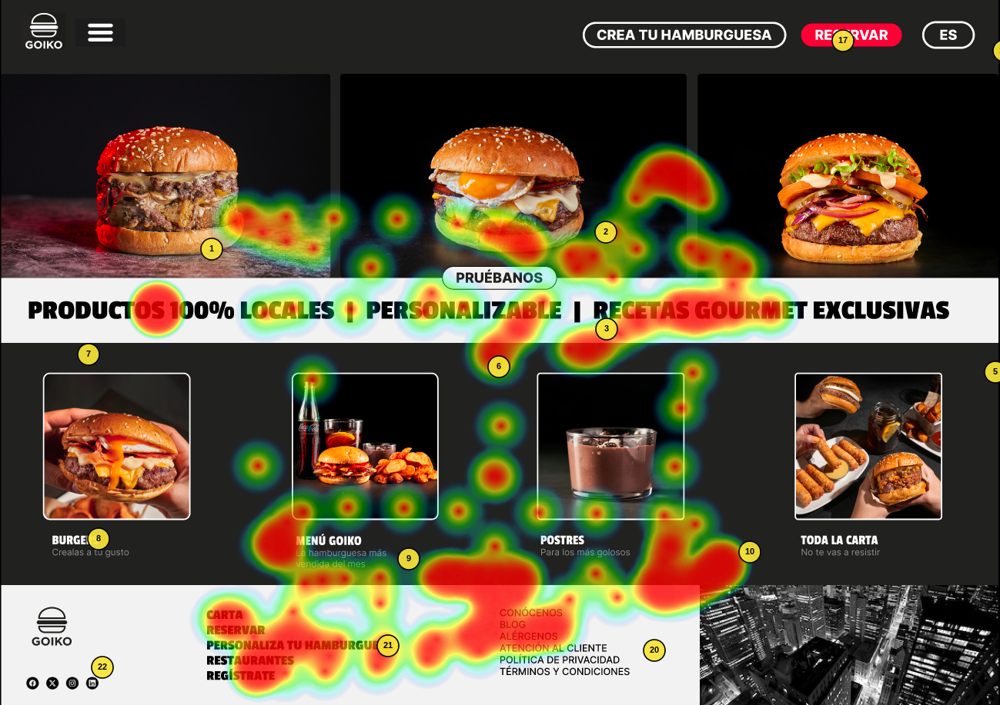 | 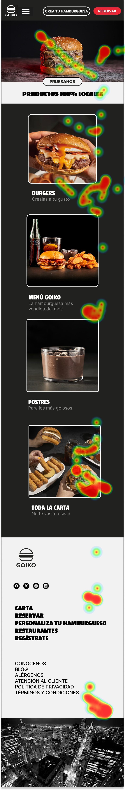 | 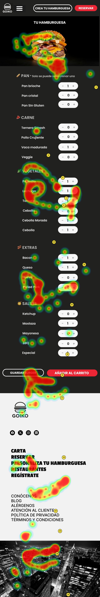 |

|           Heatmap 3           |           Heatmap 4           |           Heatmap 5           |
| :---------------------------: | :---------------------------: | :---------------------------: |
| 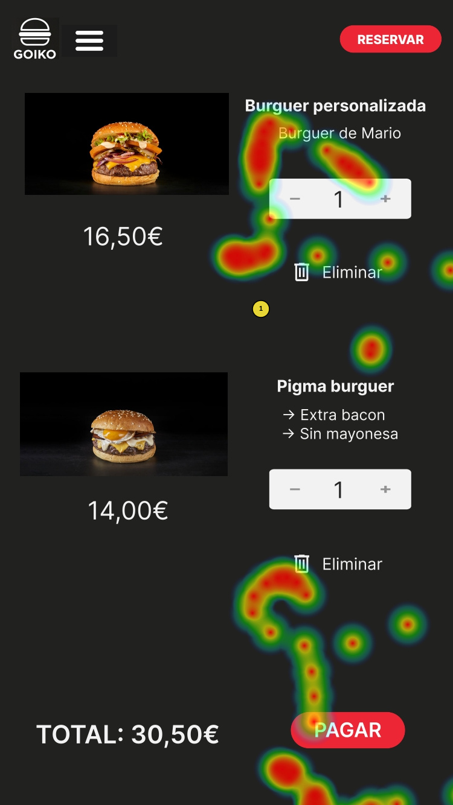 | 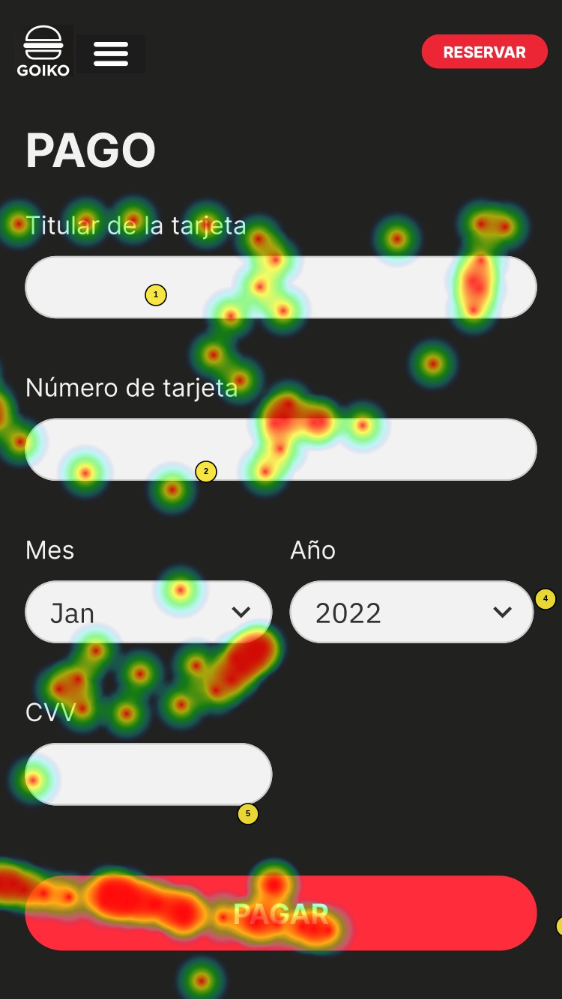 | 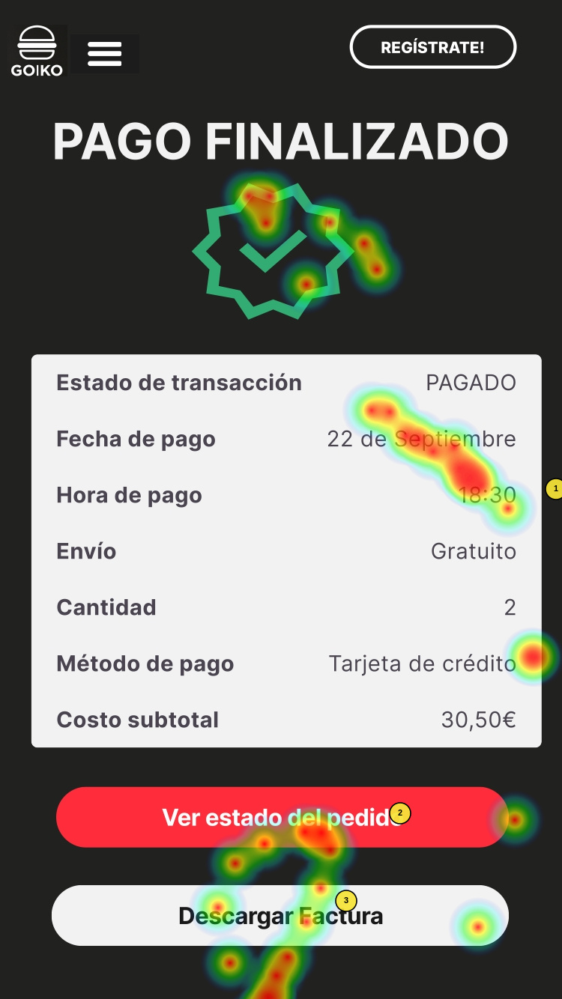 |

---

#### Caso A — NeoQarmita

**Pantallas analizadas:** Landing Page, Agenda Cultural, Página de novedades y Tienda

**Observaciones principales:**

- En la **Landing Page**, los usuarios fijaron la mirada de forma inmediata en el eslogan central y el botón "¡RESERVA YA!", que muestra la mayor concentración de calor. La doble columna de promociones recibe atención equitativa, lo que valida la distribución visual.
- En la **Agenda Cultural**, los filtros y el calendario interactivo concentran gran parte de la atención antes que las tarjetas de eventos. Los botones de inscripción son localizados con facilidad gracias al contraste cromático de la terracota sobre fondo crema.
- Fernando (60 años, nivel bajo) mostró un patrón de lectura más lento pero lineal, lo que indica que la jerarquía tipográfica funciona bien incluso para usuarios con menor destreza digital.

**Mapas de calor — Caso A:**

|           Heatmap Conjunto 1           |           Heatmap Conjunto 2           |
| :------------------------------------: | :------------------------------------: |
| 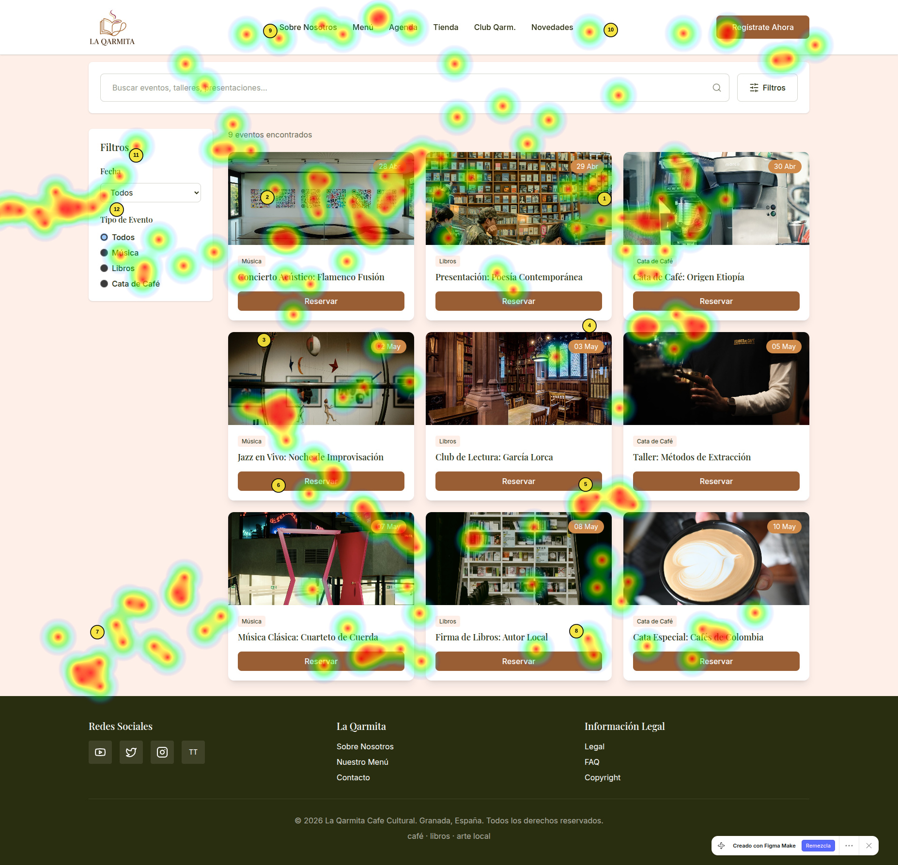 | 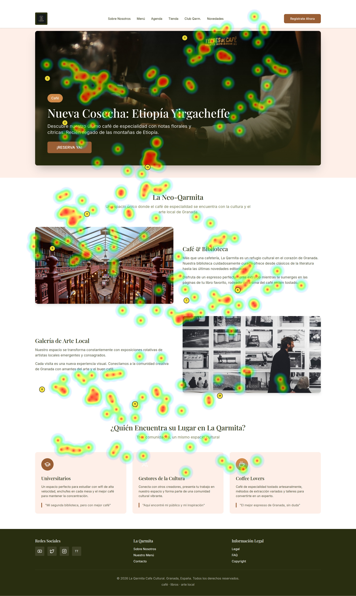 |

|           Heatmap Conjunto 3           |           Heatmap Conjunto 4           |
| :------------------------------------: | :------------------------------------: |
| 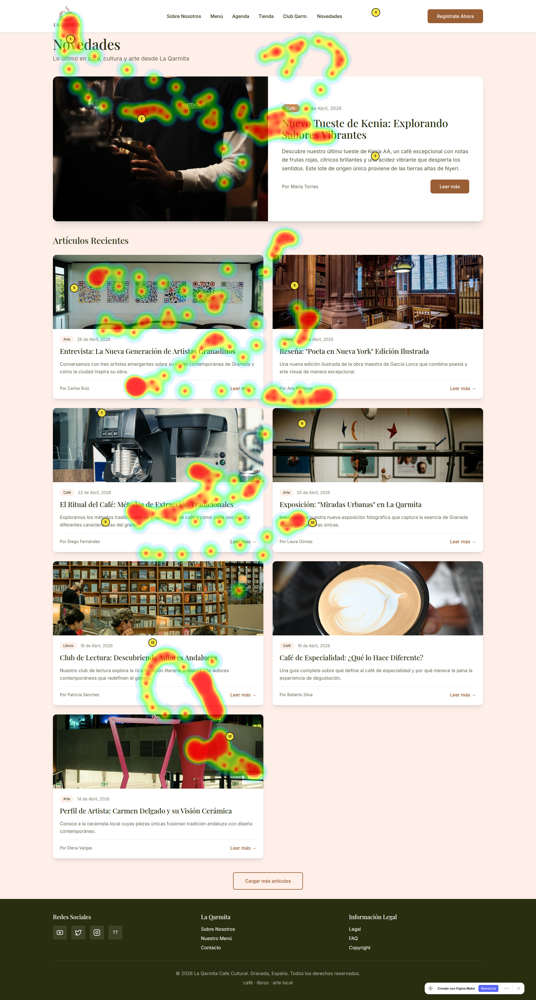 | 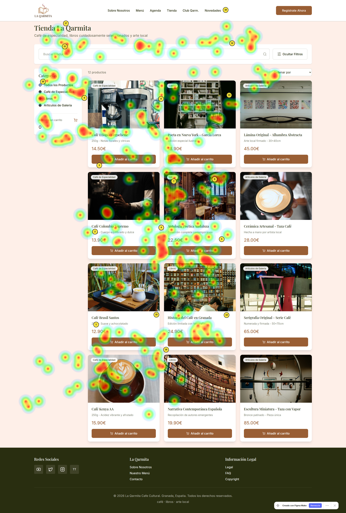 |

### 4.f Usability Report de B

El informe de usabilidad completo del Caso B (Mejora de Goiko) está disponible en:

📄 **[P5/Usability-Report-template.md](P5/Usability-Report-template.md)**

El informe recoge los hallazgos del estudio A/B, el análisis SUS multivariable, las observaciones de Eye Tracking y la auditoría de accesibilidad, con recomendaciones concretas de mejora para el diseño de Mejora de Goiko.

**Valoración personal del equipo:**

El proceso de evaluación cruzada ha sido especialmente enriquecedor. Evaluar un diseño ajeno con metodología estructurada (SUS + Eye Tracking) nos ha obligado a ser objetivos y a detectar patrones que en nuestro propio diseño pasaríamos por alto. El punto más revelador fue comprobar cómo el proceso de reserva del Caso B, que sobre papel parece completo, genera frustración real en usuarios con perfil no técnico. Esta experiencia refuerza la importancia de las pruebas con usuarios reales frente a la evaluación heurística interna.

### 4.g Evaluación de Accesibilidad — Caso B (Mejora de Goiko)

Se ha realizado una auditoría de accesibilidad sobre la web del Caso B ([https://goikomejorado.surge.sh](https://goikomejorado.surge.sh)) utilizando dos herramientas automáticas: **WAVE** y **Google Lighthouse** (escritorio y móvil). El marco de referencia aplicado es **WCAG 2.1 nivel AA**.

---

#### WAVE — Web Accessibility Evaluation Tool

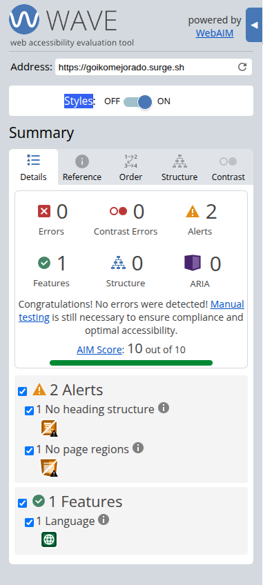

WAVE no detectó ningún error crítico ni error de contraste, obteniendo una puntuación **AIM de 10/10**. Sin embargo, registró **2 alertas** relevantes:

- **Sin estructura de encabezados** (*No heading structure*): la página no utiliza etiquetas `<h1>`, `<h2>`, etc. de forma jerárquica. Esto impide que los usuarios de lectores de pantalla naveguen por secciones y que los motores de búsqueda identifiquen la jerarquía del contenido.
- **Sin regiones de página** (*No page regions*): no se han definido landmarks semánticos (`<header>`, `<main>`, `<nav>`, `<footer>`), lo que dificulta la navegación por teclado y con tecnologías asistivas.

Como punto positivo, **el idioma de la página está correctamente definido**, lo que permite a los lectores de pantalla pronunciar el contenido en el idioma correcto.

---

#### Lighthouse — Google PageSpeed Insights

🔗 **[Ver informe completo](https://pagespeed.web.dev/analysis/https-goikomejorado-surge-sh/f74idwafuv?form_factor=mobile&category=performance&category=accessibility&category=best-practices&category=seo&hl=es-419&utm_source=lh-chrome-ext)**

**Escritorio:**

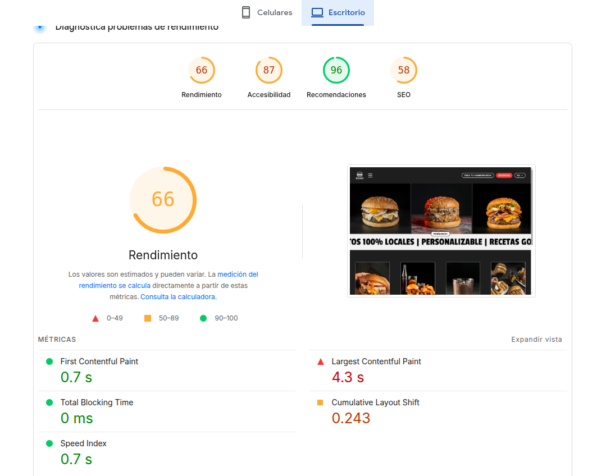

| Métrica        | Puntuación |
| --------------- | ----------- |
| Rendimiento     | 66 / 100    |
| Accesibilidad   | 87 / 100    |
| Recomendaciones | 96 / 100    |
| SEO             | 58 / 100    |

**Móvil:**

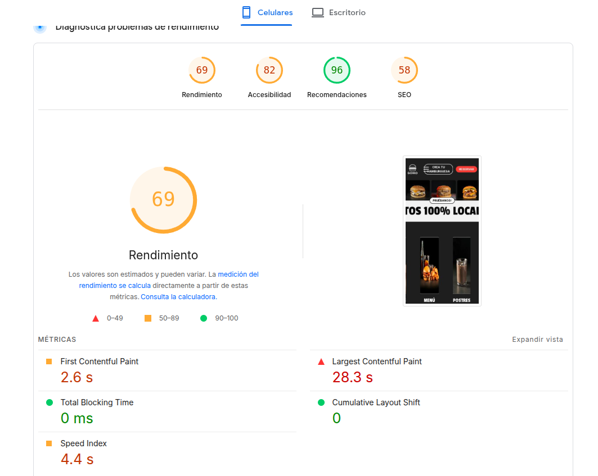

| Métrica        | Puntuación |
| --------------- | ----------- |
| Rendimiento     | 69 / 100    |
| Accesibilidad   | 82 / 100    |
| Recomendaciones | 96 / 100    |
| SEO             | 58 / 100    |

---

#### Análisis por categorías WCAG

| **Categoría**   | **Hallazgo**                                               | **Criterio WCAG**              | **Impacto**                                                                                               | **Recomendación**                                                                                         |
| ---------------------- | ---------------------------------------------------------------- | ------------------------------------ | --------------------------------------------------------------------------------------------------------------- | ---------------------------------------------------------------------------------------------------------------- |
| **Perceptible**  | Sin estructura de encabezados (`<h1>`, `<h2>`...)            | 1.3.1 — Información y relaciones   | Los usuarios con lector de pantalla no pueden identificar la jerarquía de contenido                            | Añadir etiquetas de encabezado semánticas y jerárquicas en todas las secciones                                |
| **Perceptible**  | Largest Contentful Paint de 28.3s en móvil                      | 1.4.4 — Cambio de tamaño del texto | Las imágenes pesadas bloquean la carga del contenido principal, afectando a usuarios con conexión lenta       | Optimizar y comprimir imágenes para móvil; usar formatos WebP y lazy loading                                   |
| **Operable**     | Cumulative Layout Shift de 0.243 en escritorio                   | 2.5.3 — Etiqueta en nombre          | El desplazamiento visual durante la carga puede provocar clics accidentales en elementos incorrectos            | Reservar espacio explícito para imágenes y elementos cargados de forma asíncrona                              |
| **Comprensible** | Sin regiones de página (`<main>`, `<nav>`, `<footer>`)    | 1.3.6 — Identificar el propósito   | La navegación por teclado o lector de pantalla carece de puntos de referencia                                  | Añadir landmarks HTML5 semánticos en la estructura de la página                                               |
| **Robusto**      | SEO 58/100; sin metadatos estructurados ni etiquetas semánticas | 4.1.1 — Análisis sintáctico       | Los agentes de usuario y tecnologías asistivas no pueden interpretar correctamente la estructura del documento | Añadir metaetiquetas descriptivas,`aria-label` en elementos interactivos y estructurar el HTML con roles ARIA |

---

#### Valoración general de accesibilidad

La web de Mejora de Goiko presenta una base accesible aceptable: ausencia de errores críticos de contraste y buen cumplimiento de buenas prácticas (96/100). Sin embargo, los problemas estructurales —falta de encabezados semánticos y de landmarks de página— suponen un incumplimiento del criterio **WCAG 2.1 AA** que penaliza especialmente a usuarios con discapacidad visual que utilizan tecnologías asistivas.

El punto más crítico es el **rendimiento en móvil**: un LCP de 28.3 segundos es inaceptable para un sitio de restauración donde el usuario espera acceso inmediato al menú o a la reserva. Esto, combinado con un SEO de 58/100, indica que el sitio no está optimizado ni para la accesibilidad real ni para la visibilidad en buscadores.

**Puntuación global estimada: 6/10** — Cumple los mínimos técnicos pero requiere mejoras estructurales y de rendimiento para alcanzar el nivel AA de forma completa.

<br>

## Paso 5. Exportación y Documentación (P4)

### 5.a Exportación a React (Figma Make)

El diseño Hi-Fi de la P3 ha sido exportado a una **aplicación React** funcional mediante **Figma Make** (Opción B). El proyecto generado utiliza el stack completo recomendado:

- **Vite 6** + **React 18** como entorno de producción
- **Tailwind CSS v4** para los estilos, con Design Tokens del sistema de diseño de la P3
- **shadcn/ui** (componentes Radix UI accesibles) + **Lucide React** (iconos)
- **react-router** para la navegación entre páginas

El proyecto está disponible en [P4/LaNeoQarmita/](P4/LaNeoQarmita/). Para ejecutarlo localmente:

```bash
cd P4/LaNeoQarmita
pnpm install && pnpm approve-builds
pnpm dev   # → http://localhost:5173
```

Páginas implementadas: **Home**, **Agenda** (con filtros), **Detalle de Evento**, **Tienda**, **Menú**, **Novedades**, **Sobre Nosotros** y **Registro/Club Qarmita**.

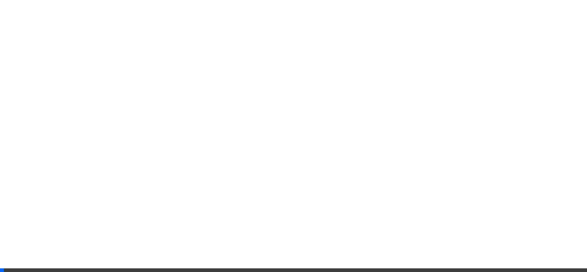

🌐 **Web en producción:** [https://errores404-laqarmita.surge.sh](https://errores404-laqarmita.surge.sh)

### 5.b Documentación de componentes y Briefing

La documentación completa del proceso (alternativas evaluadas, stack tecnológico, estructura de componentes por nivel atómico, y briefing del proceso) está disponible en:

📄 **[Readme P4](./P4/readme.md)**

<br>

## Conclusiones finales & Valoración de las prácticas

>>> Opinión FINAL del proceso de desarrollo de diseño siguiendo metodología UX y valoración (positiva /negativa) de los resultados obtenidos. ¿Qué se puede mejorar? Recuerda que este tipo de texto se debe eliminar del template que se os proporciona
>>>
>>
